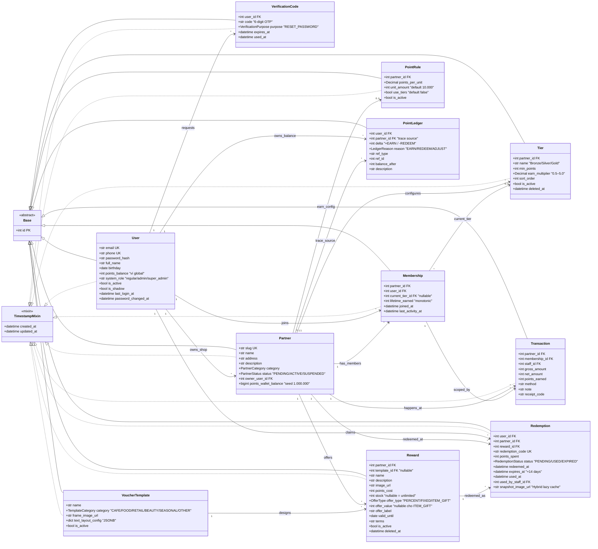

# Sơ đồ class — MVP "Cân bằng" 2026-04-25

> Sơ đồ class SQLAlchemy theo **state target sau pivot** (xem spec canonical: `docs/spec-mvp-2026-04-25.md`).
> KHÔNG phản ánh state code hiện tại — code sẽ migrate qua revision `d4e5f6a7b8c9_pivot_to_mvp_balanced`.

## Tổng quan 4 cụm domain

| Cụm | Class | Vai trò |
|---|---|---|
| Identity | `User`, `VerificationCode` | Tài khoản + OTP forgot-password |
| Partner | `Partner`, `Membership`, `Tier`, `PointRule` | Shop + cấu hình tier per-partner + rule earn |
| Loyalty Ops | `Transaction`, `PointLedger`, `Redemption` | POS earn / append-only ledger / đổi quà |
| Reward | `Reward`, `VoucherTemplate` | Quà + design template (Hybrid C+i) |

## Sơ đồ

## Schema invariants (kiểm tra ở test layer)

- `point_ledger` append-only — Postgres trigger `prevent_point_ledger_mutation` block UPDATE/DELETE
- `UNIQUE (partner_id, user_id)` trên `memberships`
- `UNIQUE (partner_id, name)` + `UNIQUE (partner_id, sort_order)` trên `tiers`
- Partial unique 1 active rule/shop trên `point_rules` (`WHERE is_active=true`)
- `lifetime_earned` chỉ tăng (monotonic), không giảm khi redeem
- `SUM(point_ledger.delta WHERE user_id=u) == users.points_balance`
- `partners.points_wallet_balance + SUM(EARN ledger WHERE partner_id=p) == 1.000.000` (wallet seed invariant)

## Cách render & export

- **Online**: paste khối Mermaid vào https://mermaid.live → tải PNG/SVG
- **VS Code**: extension *Markdown Preview Mermaid Support*
- **CLI**: `mmdc -i class-diagram-mvp-2026-04-25.mmd -o class-diagram-mvp-2026-04-25.png -t neutral -b white`

## Files đính kèm

- `class-diagram-mvp-2026-04-25.mmd` — source Mermaid thuần (cho `mmdc`)
- `class-diagram-mvp-2026-04-25.png` — bitmap (paste vào Word/PDF báo cáo)
- `class-diagram-mvp-2026-04-25.svg` — vector (zoom không vỡ nét)
