# MÔ TẢ DỮ LIỆU CHO SƠ ĐỒ BÁO CÁO

Tài liệu này mô tả chi tiết để bạn vẽ các sơ đồ UML cho báo cáo: **Use Case**, **ERD**, **Sequence Diagram**.

Bạn có thể dùng các tool sau để vẽ:
- **draw.io** (diagrams.net) — phổ biến nhất, miễn phí
- **StarUML** — chuyên UML, cho thesis
- **Visio** — nếu trường yêu cầu
- **Mermaid Live Editor** (mermaid.live) — paste code Mermaid → export PNG/SVG ngay
- **PlantUML** — text-based UML

Phần Mermaid trong tài liệu này có thể paste trực tiếp vào Mermaid Live Editor.

---

## MỤC LỤC

1. [Sơ đồ Use Case](#1-sơ-đồ-use-case)
2. [Sơ đồ ERD (Entity-Relationship Diagram)](#2-sơ-đồ-erd)
3. [Sơ đồ tuần tự (Sequence Diagrams)](#3-sơ-đồ-tuần-tự)
   - 3.1. Luồng A — Đăng ký doanh nghiệp
   - 3.2. Luồng B — Tạo thành viên qua SĐT
   - 3.3. Luồng C — Tích điểm qua QR cá nhân
   - 3.4. Luồng D — Đổi điểm lấy quà
   - 3.5. Luồng E — Khách claim voucher
   - 3.6. Luồng F — Voucher sinh nhật (background job)
   - 3.7. Luồng G — Upgrade hạng thành viên
   - 3.8. Luồng H — Quản lý nhân viên
   - 3.9. Luồng L — Khách tự join shop

---

## 1. SƠ ĐỒ USE CASE

### 1.1. Actors (4)

| Actor | Mô tả |
|---|---|
| **Super Admin** | Quản lý toàn nền tảng, duyệt doanh nghiệp đăng ký |
| **Chủ doanh nghiệp** (Owner) | Quản lý 1 shop: cấu hình, nhân viên, khuyến mãi, thống kê |
| **Nhân viên** (Staff) | Vận hành tại quầy: tạo giao dịch, đổi quà, áp voucher |
| **Khách hàng** (Customer) | Người dùng cuối: tích/đổi điểm, xem voucher, claim |

> Actor "Chủ doanh nghiệp" là chuyên hóa của "Nhân viên" — owner có tất cả quyền của staff trong tenant đó. Trong sơ đồ, có thể vẽ Owner kế thừa (generalization) từ Staff, hoặc vẽ tách biệt.

### 1.2. Danh sách Use Case theo Actor

#### A. Super Admin
| ID | Use Case |
|---|---|
| UC-A01 | Đăng nhập |
| UC-A02 | Đăng xuất |
| UC-A03 | Xem danh sách doanh nghiệp đăng ký |
| UC-A04 | Duyệt doanh nghiệp (Approve / Reject) |
| UC-A05 | Xem thống kê nền tảng |

#### B. Chủ doanh nghiệp (Owner)
| ID | Use Case |
|---|---|
| UC-B01 | Đăng ký tài khoản doanh nghiệp |
| UC-B02 | Đăng nhập |
| UC-B03 | Đăng xuất |
| UC-B04 | Cấu hình thông tin shop (tên, logo, settings) |
| UC-B05 | Quản lý hạng thành viên (CRUD tier) |
| UC-B06 | Cấu hình quy tắc tích điểm (point rules) |
| UC-B07 | Quản lý quà tặng (CRUD rewards) |
| UC-B08 | Tạo chiến dịch khuyến mãi |
| UC-B09 | Quản lý nhân viên (thêm/xóa/đổi role) |
| UC-B10 | Xem dashboard và thống kê shop |
| UC-B11 | Xem danh sách thành viên |
| UC-B12 | Tạo giao dịch tích điểm (kế thừa từ Staff) |
| UC-B13 | Xác nhận đổi quà (kế thừa từ Staff) |

#### C. Nhân viên (Staff)
| ID | Use Case |
|---|---|
| UC-C01 | Đăng nhập |
| UC-C02 | Đăng xuất |
| UC-C03 | Tạo giao dịch — nhập SĐT (Luồng B) |
| UC-C04 | Tạo giao dịch — quét QR khách (Luồng C) |
| UC-C05 | Hiển thị QR cửa hàng cho khách quét |
| UC-C06 | Áp voucher khi tạo giao dịch |
| UC-C07 | Xác nhận khách đổi quà (nhập mã redemption) |
| UC-C08 | Xem lịch sử giao dịch của shop |

#### D. Khách hàng (Customer)
| ID | Use Case |
|---|---|
| UC-D01 | Đăng ký tài khoản |
| UC-D02 | Claim shadow account (nhập verification code) |
| UC-D03 | Đăng nhập |
| UC-D04 | Đăng xuất |
| UC-D05 | Reset mật khẩu |
| UC-D06 | Cập nhật hồ sơ cá nhân |
| UC-D07 | Xem điểm và hạng theo từng shop |
| UC-D08 | Hiển thị QR cá nhân |
| UC-D09 | Xem lịch sử giao dịch |
| UC-D10 | Browse danh sách shop public |
| UC-D11 | Tự join shop (Luồng L) |
| UC-D12 | Đổi điểm lấy quà |
| UC-D13 | Xem catalog quà |
| UC-D14 | Xem voucher của mình |
| UC-D15 | Claim voucher từ campaign đủ điều kiện |
| UC-D16 | Cài đặt PWA trên điện thoại |

### 1.3. Quan hệ include / extend

| Quan hệ | Use Case A | → | Use Case B | Loại |
|---|---|---|---|---|
| 1 | UC-C03 (Tạo giao dịch SĐT) | «include» | UC-B/Tạo membership nếu khách mới | include |
| 2 | UC-C04 (Quét QR) | «extend» | UC-C03 (Fall back nhập SĐT nếu khách chưa là TV) | extend |
| 3 | UC-C06 (Áp voucher) | «extend» | UC-C03 hoặc UC-C04 | extend |
| 4 | UC-C03/C04 | «include» | Auto upgrade hạng (UC ngầm) | include |
| 5 | UC-D12 (Đổi điểm) | «include» | Sinh mã redemption | include |
| 6 | UC-D15 (Claim voucher) | «include» | Tạo voucher cá nhân | include |
| 7 | UC-D02 (Claim shadow) | «include» | Verify code | include |
| 8 | UC-B01 (Đăng ký DN) | «include» | UC-A04 (cần Super Admin duyệt) | include |
| 9 | UC-B09 (Quản lý NV) | «extend» | UC-D02 (NV mới claim shadow nếu chưa có account) | extend |

### 1.4. Mermaid Use Case (preview)

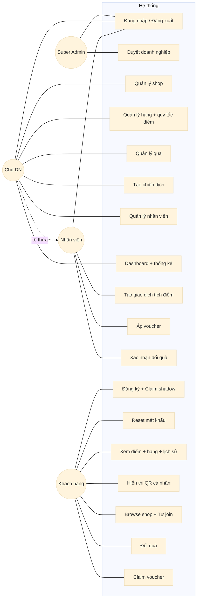

> Lưu ý: Mermaid không có syntax UML use case chuẩn. Khi vẽ chính thức trong báo cáo, dùng draw.io với template Use Case Diagram để có hình elip + actor stick figure đúng UML.

---

## 2. SƠ ĐỒ ERD

### 2.1. Danh sách 14 entities

| # | Entity | Mô tả ngắn |
|---|---|---|
| 1 | `users` | Tài khoản toàn hệ thống |
| 2 | `tenants` | Doanh nghiệp đăng ký nền tảng |
| 3 | `tenant_staff` | Liên kết user ↔ tenant theo role (owner/staff) |
| 4 | `memberships` | Quan hệ khách hàng ↔ tenant |
| 5 | `tiers` | Hạng thành viên của mỗi tenant |
| 6 | `point_rules` | Quy tắc tính điểm của mỗi tenant |
| 7 | `transactions` | Giao dịch tích điểm |
| 8 | `point_ledger` | Audit log mọi biến động điểm (append-only) |
| 9 | `rewards` | Catalog quà tặng |
| 10 | `redemptions` | Lịch sử khách đổi quà |
| 11 | `campaigns` | Chiến dịch khuyến mãi |
| 12 | `vouchers` | Voucher cá nhân của khách |
| 13 | `notifications` | Thông báo in-app |
| 14 | `verification_codes` | Mã xác thực claim shadow / reset password |

### 2.2. Chi tiết các bảng

#### `users`
| Thuộc tính | Kiểu | Ràng buộc |
|---|---|---|
| **id** | INTEGER | **PK**, AUTO INCREMENT |
| email | VARCHAR(255) | NULLABLE, UNIQUE (partial) |
| phone | VARCHAR(20) | NULLABLE, UNIQUE (partial), format E.164 |
| password_hash | VARCHAR(255) | NULLABLE (NULL cho shadow user) |
| full_name | VARCHAR(255) | NULLABLE |
| birthday | DATE | NULLABLE |
| is_active | BOOLEAN | DEFAULT TRUE |
| is_shadow | BOOLEAN | DEFAULT FALSE |
| system_role | VARCHAR(20) | DEFAULT 'regular' (super_admin / regular) |
| last_login_at | TIMESTAMPTZ | NULLABLE |
| created_at | TIMESTAMPTZ | DEFAULT NOW() |

#### `tenants`
| Thuộc tính | Kiểu | Ràng buộc |
|---|---|---|
| **id** | INTEGER | **PK** |
| name | VARCHAR(255) | NOT NULL |
| slug | VARCHAR(100) | UNIQUE, NOT NULL |
| owner_user_id | INTEGER | **FK** → users.id |
| status | VARCHAR(20) | pending / active / suspended |
| logo_url | VARCHAR(500) | NULLABLE |
| description | TEXT | NULLABLE |
| settings | JSONB | DEFAULT {} |
| created_at | TIMESTAMPTZ | DEFAULT NOW() |

#### `tenant_staff`
| Thuộc tính | Kiểu | Ràng buộc |
|---|---|---|
| **id** | INTEGER | **PK** |
| tenant_id | INTEGER | **FK** → tenants.id |
| user_id | INTEGER | **FK** → users.id |
| role | VARCHAR(20) | owner / staff |
| added_at | TIMESTAMPTZ | DEFAULT NOW() |

UNIQUE(tenant_id, user_id)

#### `memberships`
| Thuộc tính | Kiểu | Ràng buộc |
|---|---|---|
| **id** | INTEGER | **PK** |
| tenant_id | INTEGER | **FK** → tenants.id |
| user_id | INTEGER | **FK** → users.id |
| current_tier_id | INTEGER | **FK** → tiers.id, NULLABLE |
| points_balance | INTEGER | DEFAULT 0, CHECK ≥ 0 |
| total_points_earned | INTEGER | DEFAULT 0 |
| joined_at | TIMESTAMPTZ | DEFAULT NOW() |
| last_activity_at | TIMESTAMPTZ | NULLABLE |
| archived_at | TIMESTAMPTZ | NULLABLE (cho luận văn churn) |

UNIQUE(tenant_id, user_id)

#### `tiers`
| Thuộc tính | Kiểu | Ràng buộc |
|---|---|---|
| **id** | INTEGER | **PK** |
| tenant_id | INTEGER | **FK** → tenants.id |
| name | VARCHAR(100) | NOT NULL |
| min_points | INTEGER | DEFAULT 0 |
| perks | JSONB | DEFAULT {} |
| is_active | BOOLEAN | DEFAULT TRUE |
| deleted_at | TIMESTAMPTZ | NULLABLE (soft delete) |

#### `point_rules`
| Thuộc tính | Kiểu | Ràng buộc |
|---|---|---|
| **id** | INTEGER | **PK** |
| tenant_id | INTEGER | **FK** → tenants.id |
| points_per_unit | DECIMAL(10,2) | vd 1.0 điểm / 1000 VND |
| min_amount | INTEGER | DEFAULT 0 |
| is_active | BOOLEAN | DEFAULT TRUE |

UNIQUE(tenant_id) WHERE is_active = TRUE

#### `transactions`
| Thuộc tính | Kiểu | Ràng buộc |
|---|---|---|
| **id** | INTEGER | **PK** |
| tenant_id | INTEGER | **FK** → tenants.id |
| membership_id | INTEGER | **FK** → memberships.id |
| staff_id | INTEGER | **FK** → users.id |
| gross_amount | INTEGER | NOT NULL (VND trước voucher) |
| voucher_id | INTEGER | **FK** → vouchers.id, NULLABLE |
| voucher_discount_amount | INTEGER | NULLABLE |
| net_amount | INTEGER | NOT NULL |
| points_earned | INTEGER | NOT NULL |
| method | VARCHAR(20) | manual / qr_shop / qr_customer |
| note | TEXT | NULLABLE |
| created_at | TIMESTAMPTZ | DEFAULT NOW() |

#### `point_ledger` ★ APPEND-ONLY
| Thuộc tính | Kiểu | Ràng buộc |
|---|---|---|
| **id** | INTEGER | **PK** |
| tenant_id | INTEGER | **FK** → tenants.id |
| membership_id | INTEGER | **FK** → memberships.id |
| delta | INTEGER | + cộng / − trừ |
| reason | VARCHAR(20) | earn / redeem / adjust / expire / refund |
| ref_type | VARCHAR(20) | transaction / redemption / manual / system |
| ref_id | INTEGER | id của record nguồn |
| balance_after | INTEGER | snapshot balance sau delta |
| description | TEXT | NULLABLE |
| created_at | TIMESTAMPTZ | DEFAULT NOW() |

PostgreSQL trigger chặn UPDATE/DELETE.

#### `rewards`
| Thuộc tính | Kiểu | Ràng buộc |
|---|---|---|
| **id** | INTEGER | **PK** |
| tenant_id | INTEGER | **FK** → tenants.id |
| name | VARCHAR(255) | NOT NULL |
| description | TEXT | NULLABLE |
| image_url | VARCHAR(500) | NULLABLE |
| points_cost | INTEGER | NOT NULL |
| stock | INTEGER | NULLABLE (NULL = unlimited), CHECK ≥ 0 |
| is_active | BOOLEAN | DEFAULT TRUE |
| deleted_at | TIMESTAMPTZ | NULLABLE |
| created_at | TIMESTAMPTZ | DEFAULT NOW() |

#### `redemptions`
| Thuộc tính | Kiểu | Ràng buộc |
|---|---|---|
| **id** | INTEGER | **PK** |
| tenant_id | INTEGER | **FK** → tenants.id |
| membership_id | INTEGER | **FK** → memberships.id |
| reward_id | INTEGER | **FK** → rewards.id |
| points_spent | INTEGER | NOT NULL |
| redemption_code | VARCHAR(8) | NOT NULL |
| status | VARCHAR(20) | pending / used / expired |
| redeemed_at | TIMESTAMPTZ | DEFAULT NOW() |
| used_at | TIMESTAMPTZ | NULLABLE |
| used_by_staff_id | INTEGER | **FK** → users.id, NULLABLE |
| expires_at | TIMESTAMPTZ | NOT NULL |

UNIQUE(tenant_id, redemption_code)

#### `campaigns`
| Thuộc tính | Kiểu | Ràng buộc |
|---|---|---|
| **id** | INTEGER | **PK** |
| tenant_id | INTEGER | **FK** → tenants.id |
| name | VARCHAR(255) | NOT NULL |
| description | TEXT | NULLABLE |
| discount_type | VARCHAR(20) | percent / fixed |
| discount_value | INTEGER | NOT NULL |
| min_order | INTEGER | DEFAULT 0 |
| max_discount | INTEGER | NULLABLE |
| target_tier_id | INTEGER | **FK** → tiers.id, NULLABLE (NULL = mọi hạng) |
| max_issuances | INTEGER | NULLABLE |
| issued_count | INTEGER | DEFAULT 0 |
| starts_at | TIMESTAMPTZ | NOT NULL |
| ends_at | TIMESTAMPTZ | NOT NULL |
| is_active | BOOLEAN | DEFAULT TRUE |
| source | VARCHAR(20) | manual / birthday / signup |
| deleted_at | TIMESTAMPTZ | NULLABLE |
| created_at | TIMESTAMPTZ | DEFAULT NOW() |

#### `vouchers`
| Thuộc tính | Kiểu | Ràng buộc |
|---|---|---|
| **id** | INTEGER | **PK** |
| tenant_id | INTEGER | **FK** → tenants.id |
| campaign_id | INTEGER | **FK** → campaigns.id |
| membership_id | INTEGER | **FK** → memberships.id |
| code | VARCHAR(8) | NOT NULL |
| status | VARCHAR(20) | issued / used / expired |
| issued_at | TIMESTAMPTZ | DEFAULT NOW() |
| used_at | TIMESTAMPTZ | NULLABLE |
| expires_at | TIMESTAMPTZ | NOT NULL |

UNIQUE(tenant_id, code)
UNIQUE(campaign_id, membership_id) WHERE status NOT IN ('expired','used')

#### `notifications`
| Thuộc tính | Kiểu | Ràng buộc |
|---|---|---|
| **id** | INTEGER | **PK** |
| tenant_id | INTEGER | **FK** → tenants.id, NULLABLE |
| user_id | INTEGER | **FK** → users.id |
| type | VARCHAR(50) | tier_up / birthday / voucher / redemption / ... |
| title | VARCHAR(255) | NOT NULL |
| body | TEXT | NULLABLE |
| data | JSONB | NULLABLE |
| is_read | BOOLEAN | DEFAULT FALSE |
| created_at | TIMESTAMPTZ | DEFAULT NOW() |

#### `verification_codes`
| Thuộc tính | Kiểu | Ràng buộc |
|---|---|---|
| **id** | INTEGER | **PK** |
| user_id | INTEGER | **FK** → users.id |
| code_hash | VARCHAR(255) | HMAC-SHA256 |
| purpose | VARCHAR(20) | claim_shadow / reset_password |
| expires_at | TIMESTAMPTZ | NOT NULL (default now+10 phút) |
| used_at | TIMESTAMPTZ | NULLABLE |
| created_at | TIMESTAMPTZ | DEFAULT NOW() |

### 2.3. Quan hệ giữa các bảng

| # | Từ | Quan hệ | Đến | Cardinality | FK / Note |
|---|---|---|---|---|---|
| R1 | users | sở hữu | tenants | 1 — N | tenants.owner_user_id |
| R2 | users | làm việc | tenant_staff | 1 — N | tenant_staff.user_id |
| R3 | tenants | có | tenant_staff | 1 — N | tenant_staff.tenant_id |
| R4 | users | là khách | memberships | 1 — N | memberships.user_id |
| R5 | tenants | có khách | memberships | 1 — N | memberships.tenant_id |
| R6 | tenants | có hạng | tiers | 1 — N | tiers.tenant_id |
| R7 | tenants | có rule | point_rules | 1 — N (MVP: 1 active) | point_rules.tenant_id |
| R8 | tenants | có quà | rewards | 1 — N | rewards.tenant_id |
| R9 | tenants | có chiến dịch | campaigns | 1 — N | campaigns.tenant_id |
| R10 | tenants | có thông báo | notifications | 1 — N (nullable) | notifications.tenant_id |
| R11 | memberships | có giao dịch | transactions | 1 — N | transactions.membership_id |
| R12 | memberships | có đổi quà | redemptions | 1 — N | redemptions.membership_id |
| R13 | memberships | có voucher | vouchers | 1 — N | vouchers.membership_id |
| R14 | memberships | có ledger | point_ledger | 1 — N | point_ledger.membership_id |
| R15 | tiers | gán cho | memberships | 1 — N | memberships.current_tier_id |
| R16 | rewards | được đổi | redemptions | 1 — N | redemptions.reward_id |
| R17 | campaigns | sinh ra | vouchers | 1 — N | vouchers.campaign_id |
| R18 | tiers | targeting | campaigns | 1 — N (nullable) | campaigns.target_tier_id |
| R19 | vouchers | dùng trong | transactions | 0..1 — 0..1 | transactions.voucher_id |
| R20 | users | nhận | notifications | 1 — N | notifications.user_id |
| R21 | users | có verification | verification_codes | 1 — N | verification_codes.user_id |
| R22 | users | xác nhận đổi quà | redemptions | 1 — N (nullable) | redemptions.used_by_staff_id |
| R23 | users | tạo giao dịch | transactions | 1 — N | transactions.staff_id |

### 2.4. Mermaid ERD

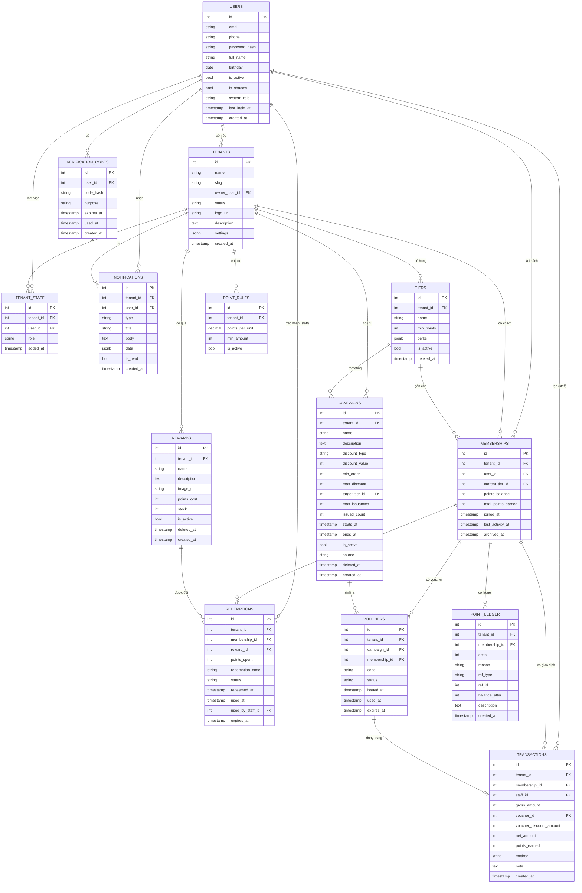

> Khi vẽ chính thức trong báo cáo, dùng draw.io với template ERD (Entity Relationship) — nó sẽ render đẹp hơn Mermaid và có Crow's Foot notation chuẩn.

---

## 3. SƠ ĐỒ TUẦN TỰ (SEQUENCE DIAGRAMS)

### 3.1. Luồng A — Đăng ký doanh nghiệp mới

**Lifelines:** Owner, `/merchant` UI, AuthService, TenantService, NotificationService, Database, SuperAdmin, `/admin` UI

**Mô tả tuần tự:**

1. Owner vào `/merchant/register`
2. UI gửi `POST /auth/register` → AuthService
3. AuthService → DB: INSERT user, hash password
4. DB → AuthService: user_id
5. AuthService → UI: TokenResponse (access + refresh)
6. UI gửi `POST /tenants` (kèm token) → TenantService
7. TenantService → DB: INSERT tenant (status=pending), tenant_staff (role=owner)
8. DB → TenantService: tenant_id
9. TenantService → NotificationService: thông báo cho Super Admin "Có tenant mới chờ duyệt"
10. NotificationService → DB: INSERT notification cho Super Admin
11. Super Admin vào `/admin` → UI gửi `GET /admin/tenants?status=pending`
12. UI hiển thị list pending
13. Super Admin bấm "Approve"
14. UI gửi `POST /admin/tenants/{id}/approve`
15. TenantService → DB: UPDATE tenant SET status='active'
16. NotificationService → DB: INSERT notification cho Owner "Doanh nghiệp đã được duyệt"
17. Owner refresh `/merchant` → thấy tenant active, có thể cấu hình

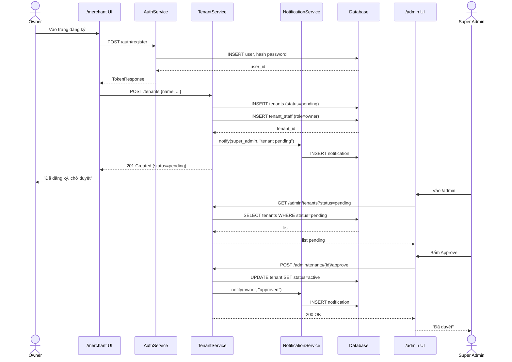

---

### 3.2. Luồng B — Tạo thành viên qua SĐT (Staff nhập tại quầy)

**Lifelines:** Customer, Staff, `/pos` UI, MemberService, TransactionService, LedgerService, TierService, NotificationService, Database

**3 cases trong 1 luồng:**
- Case 1: Khách hoàn toàn mới
- Case 2: Khách đã có shadow user (do tenant khác)
- Case 3: Khách đã có user thường (đã đăng ký)

**Mô tả tuần tự (case chung):**

1. Khách đến quầy lần đầu
2. Staff mở `/pos` → tạo giao dịch → nhập SĐT
3. UI gửi `POST /transactions` với `{phone, amount}` + header `X-Tenant-Id`
4. TransactionService → MemberService.upsert_user_by_phone(phone)
5. MemberService → DB: `INSERT users (phone, is_shadow=true) ON CONFLICT DO NOTHING`
6. DB → MemberService: user_id (mới hoặc cũ)
7. MemberService → DB: `INSERT memberships (tenant_id, user_id) ON CONFLICT DO NOTHING`
8. DB → MemberService: membership_id
9. TransactionService: SELECT FOR UPDATE membership, lấy point_rules
10. TransactionService: tính `points_earned`
11. TransactionService → DB: INSERT transaction
12. LedgerService → DB: INSERT point_ledger (delta=+points, reason=earn)
13. TransactionService → DB: UPDATE memberships SET points_balance, total_points_earned
14. TierService.recompute_tier(membership_id)
15. (Nếu upgrade) NotificationService → DB: INSERT notification "Lên hạng X"
16. UI hiển thị kết quả cho Staff
17. Staff thông báo cho khách

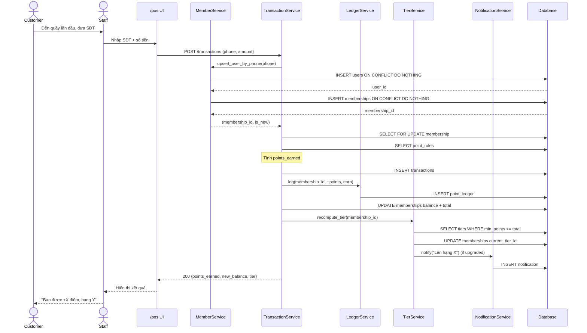

---

### 3.3. Luồng C — Tích điểm qua QR cá nhân

**Lifelines:** Customer, Staff, `/member` PWA, `/pos` UI, AuthService, MemberService, TransactionService, LedgerService, Database

**Tiền đề:** Khách đã là thành viên tenant hiện tại.

**Mô tả tuần tự:**

1. Customer mở `/member` → màn hình chính
2. PWA gửi `GET /member/qr` → AuthService
3. AuthService → ký JWT `{user_id, exp: now+120s}` + sinh `fallback_code`
4. AuthService → PWA: `{jwt, exp_at_server, fallback_code}`
5. PWA hiển thị QR (chứa JWT) — countdown dựa trên `exp_at_server`
6. Staff mở `/pos` → "Quét QR khách" → quét camera
7. UI gửi `POST /transactions` với `{qr_payload, amount}` + header `X-Tenant-Id`
8. TransactionService → AuthService: decode JWT, verify exp với leeway 5s
9. AuthService → TransactionService: user_id
10. TransactionService → DB: SELECT FOR UPDATE memberships WHERE tenant_id, user_id
11. **Nếu thấy:** tiếp tục như Luồng B step 9-15
12. **Nếu KHÔNG thấy:** trả `404 NO_MEMBERSHIP` → UI hiển thị "Khách chưa là TV, mời nhập SĐT" → fall back về Luồng B
13. UI hiển thị kết quả + push notification cho khách

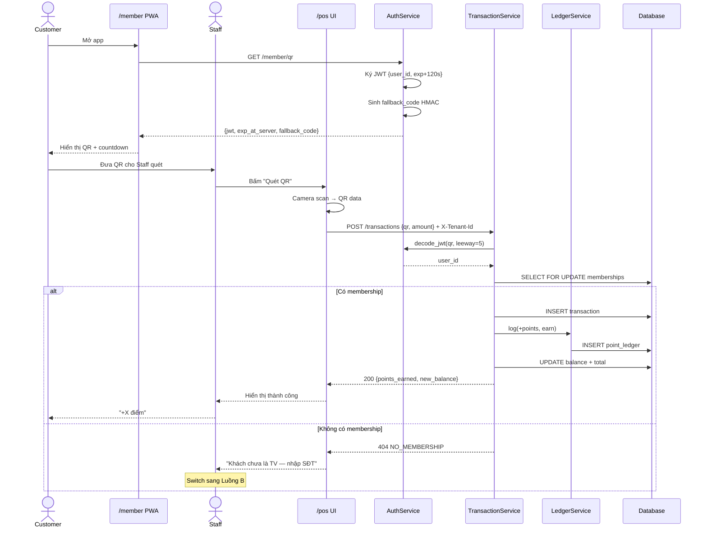

---

### 3.4. Luồng D — Đổi điểm lấy quà

**Lifelines:** Customer, `/member` PWA, RewardService, LedgerService, Database, Staff, `/pos` UI

**Mô tả tuần tự:**

1. Customer vào `/member/rewards` → xem catalog
2. PWA gửi `GET /rewards?tenant=X` → RewardService
3. RewardService → DB: SELECT rewards WHERE tenant_id, deleted_at IS NULL
4. PWA hiển thị catalog
5. Customer chọn quà → bấm "Đổi"
6. PWA gửi `POST /redemptions {reward_id}` → RewardService
7. RewardService bắt đầu DB transaction:
   - SELECT FOR UPDATE memberships → check `points_balance >= points_cost`
   - UPDATE memberships SET points_balance -= cost
   - INSERT redemption (status=pending, code, expires_at)
   - INSERT point_ledger (delta=-cost, reason=redeem)
   - UPDATE rewards SET stock -= 1 (nếu stock IS NOT NULL)
8. DB → RewardService: redemption_id, redemption_code
9. RewardService → PWA: `{redemption_code, expires_at}`
10. PWA hiển thị mã + QR redemption cho khách
11. Customer đến quầy, đưa mã cho Staff
12. Staff nhập mã vào `/pos` → `POST /redemptions/{code}/use`
13. RewardService → DB: SELECT redemption WHERE code, status=pending, expires_at > NOW()
14. RewardService → DB: UPDATE redemptions SET status=used, used_at, used_by_staff_id
15. Staff đưa quà cho khách

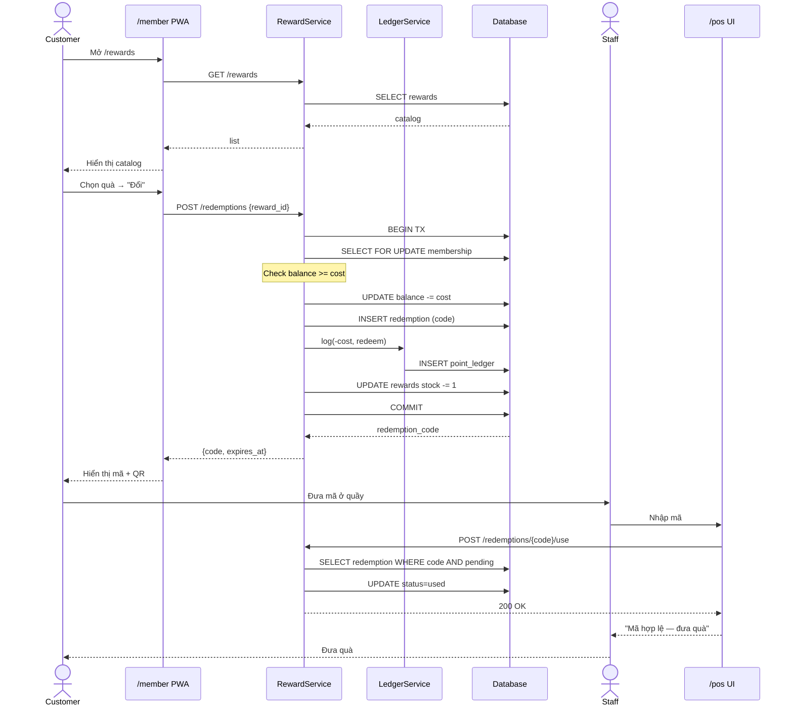

---

### 3.5. Luồng E — Khách claim voucher (lazy claim)

**Lifelines:** Customer, `/member` PWA, CampaignService, VoucherService, Database

**Mô tả tuần tự:**

1. Customer vào `/member/vouchers/available`
2. PWA gửi `GET /campaigns/eligible` → CampaignService
3. CampaignService → DB: SELECT campaigns đủ điều kiện (active, in window, đúng tier, chưa max, khách chưa claim)
4. PWA hiển thị list
5. Customer bấm "Nhận voucher" cho campaign X
6. PWA gửi `POST /vouchers/claim {campaign_id}` → VoucherService
7. VoucherService bắt đầu DB transaction:
   - **UPDATE atomic** `campaigns SET issued_count += 1 WHERE id AND active AND in_window AND (max IS NULL OR issued_count < max)`
   - Nếu rowcount = 0 → rollback → trả `409 CAMPAIGN_FULL`
   - INSERT voucher (membership, code, expires_at)
   - Nếu IntegrityError (partial unique) → rollback → trả `409 ALREADY_CLAIMED`
8. DB → VoucherService: voucher_id, code
9. VoucherService → DB: INSERT notification "Voucher đã sẵn sàng"
10. VoucherService → PWA: voucher detail
11. PWA hiển thị voucher mới

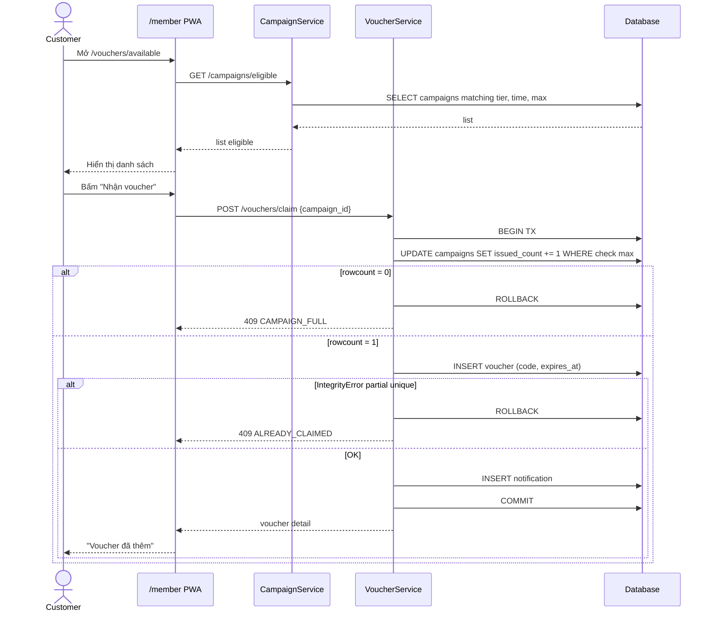

---

### 3.6. Luồng F — Voucher sinh nhật (background job, system-initiated)

**Lifelines:** APScheduler, BirthdayJob, Database, NotificationService, Customer (passive)

**Mô tả tuần tự:**

1. APScheduler trigger 00:05 ICT mỗi ngày (timezone Asia/Ho_Chi_Minh)
2. APScheduler → BirthdayJob.run()
3. BirthdayJob → DB: SELECT memberships JOIN users JOIN tenants WHERE birthday matches today AND tenant has birthday_campaign_id
4. DB → BirthdayJob: list (membership, campaign_id)
5. Loop từng (membership, campaign_id):
   - Check idempotent: SELECT vouchers WHERE campaign_id, membership_id, DATE(issued_at)=today
   - Nếu đã có → skip
   - INSERT voucher (membership_id, campaign_id, code, expires_at)
   - UPDATE campaigns SET issued_count += 1
   - INSERT notification "Chúc mừng sinh nhật"
6. BirthdayJob → ghi log file `logs/birthday-YYYY-MM-DD.log`
7. (Khách mở app sau đó) → notification hiển thị

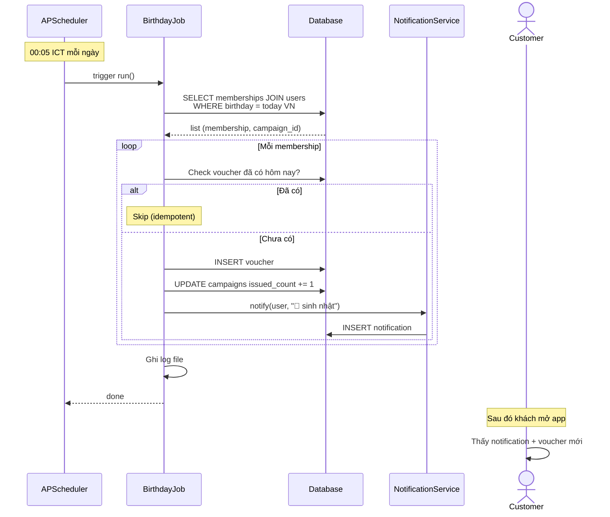

---

### 3.7. Luồng G — Upgrade hạng thành viên

**Lifelines:** TransactionService, TierService, NotificationService, Database

**Tiền đề:** Vừa hoàn thành 1 transaction tích điểm.

**Mô tả tuần tự:**

1. TransactionService (sau khi commit transaction) → TierService.recompute_tier(membership_id)
2. TierService → DB: SELECT current membership (tier, total_points_earned)
3. TierService → DB: SELECT tiers WHERE tenant_id, min_points <= total, active, deleted_at IS NULL ORDER BY min_points DESC LIMIT 1
4. Nếu `new_tier.min_points > current_tier.min_points`:
   - UPDATE memberships SET current_tier_id = new_tier.id
   - NotificationService → INSERT notification "Chúc mừng lên hạng X"
5. Nếu `new_tier.min_points < current_tier.min_points` (chỉnh tier config):
   - UPDATE memberships SET current_tier_id = new_tier.id (silent re-bind, không push noti)
6. Nếu cùng tier → không làm gì

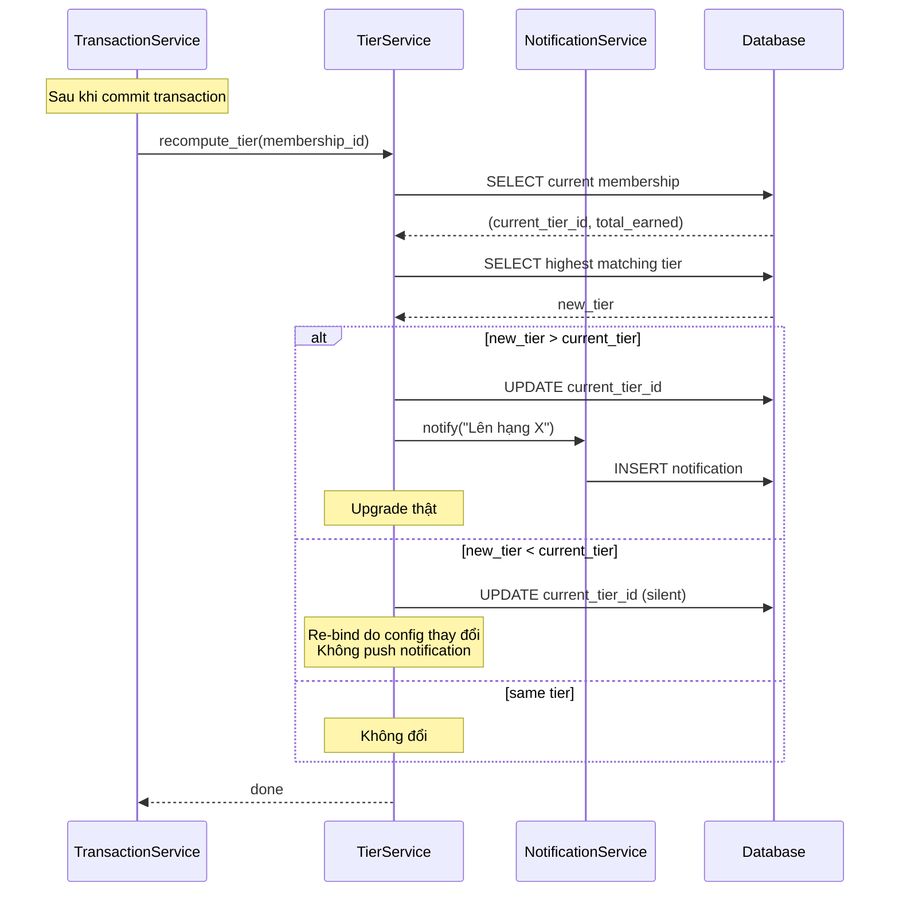

---

### 3.8. Luồng H — Quản lý nhân viên

**Lifelines:** Owner, `/merchant` UI, StaffService, MemberService, AuthService, NotificationService, Database, Staff (mới)

**Mô tả tuần tự (thêm nhân viên mới):**

1. Owner vào `/merchant/staff` → bấm "Thêm nhân viên"
2. UI hiển thị form: email, full_name, role
3. Owner submit → UI gửi `POST /merchant/staff {email, name, role}` + header `X-Tenant-Id`
4. StaffService → DB: SELECT users WHERE email
5. **Case A — User đã tồn tại:**
   - DB → StaffService: existing user_id
   - StaffService → DB: INSERT tenant_staff (tenant_id, user_id, role)
   - StaffService → NotificationService: notify staff "Bạn đã được thêm vào shop X"
6. **Case B — User chưa tồn tại:**
   - StaffService → DB: INSERT users (email, is_shadow=true, full_name)
   - StaffService → DB: INSERT tenant_staff
   - StaffService → AuthService.create_verification_code(user_id, purpose=claim_shadow)
   - AuthService → DB: INSERT verification_codes
   - AuthService → log code ra console (MVP)
7. UI hiển thị: "Nhân viên đã được thêm" (kèm verification code nếu Case B để Owner đưa cho staff)
8. (Sau đó) Staff mới đăng nhập → claim shadow flow như Luồng B Phần 2

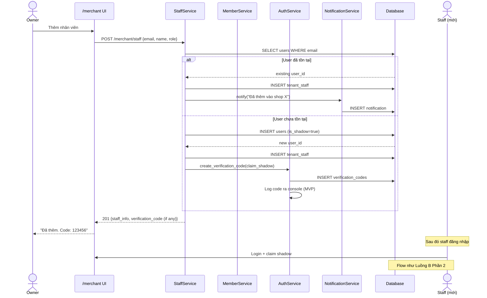

---

### 3.9. Luồng L — Khách tự join shop từ app

**Lifelines:** Customer, `/member` PWA, MemberService, NotificationService, Database

**Tiền đề:** Khách đã có user account (đã đăng ký hoặc claim shadow).

**Mô tả tuần tự:**

1. Customer mở `/member/shops`
2. PWA gửi `GET /shops/public` → MemberService
3. MemberService → DB: SELECT tenants WHERE status='active' (kèm thông tin: name, logo, mô tả, số TV)
4. PWA hiển thị danh sách shop, đánh dấu shop nào đã/chưa là TV
5. Customer chọn shop X → bấm "Tham gia"
6. PWA gửi `POST /memberships {tenant_id}` → MemberService
7. MemberService → DB: INSERT memberships (tenant_id, user_id, joined_at) ON CONFLICT (tenant_id, user_id) DO NOTHING RETURNING id
8. Nếu RETURNING có id mới:
   - NotificationService → INSERT notification "Đã tham gia shop X"
   - MemberService → PWA: 201 Created
9. Nếu RETURNING không có (đã là TV):
   - MemberService → PWA: 409 ALREADY_MEMBER
10. PWA cập nhật UI: shop X giờ đánh dấu "Đã tham gia"

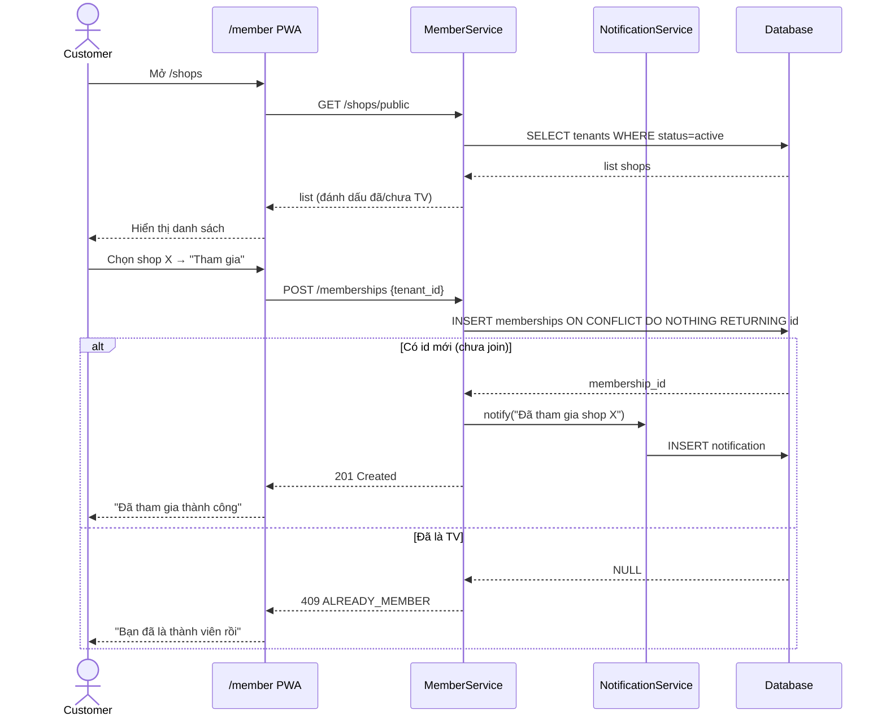

---

## 4. CÁC SƠ ĐỒ KHÁC NÊN VẼ THÊM

Ngoài 3 loại trên, báo cáo CNTT thường có thêm:

| Loại sơ đồ | Mục đích | Khi nào dùng |
|---|---|---|
| **Sơ đồ kiến trúc tổng thể** | Hiển thị các tầng (Frontend, Backend, DB, External services) | Section "Kiến trúc hệ thống" |
| **Sơ đồ triển khai (Deployment)** | Server, container, network | Section "Triển khai và demo" |
| **Sơ đồ luồng dữ liệu (DFD)** | Mô tả flow data giữa các process | Section "Phân tích thiết kế" |
| **Sơ đồ class** | Các class chính (User, Tenant, Membership, ...) | Section "Thiết kế chi tiết" |
| **State machine cho tenant.status** | pending → active → suspended | Bonus, cho thấy tư duy logic |
| **State machine cho voucher.status** | issued → used / expired | Bonus |
| **State machine cho redemption.status** | pending → used / expired | Bonus |

---

## 5. TIPS KHI VẼ

1. **Use Case:** Dùng draw.io với template "UML Use Case". Vẽ hệ thống bằng hình chữ nhật lớn, bên trong là các elip use case. Actor stick figure ở ngoài, nối với use case bằng đường thẳng.

2. **ERD:** Dùng draw.io template "Entity Relation". Mỗi entity là 1 box có header (tên bảng) + danh sách thuộc tính. Quan hệ dùng Crow's Foot notation (∞ = many, | = one).

3. **Sequence Diagram:** Dùng draw.io template "UML Sequence". Lifeline ở trên cùng, message arrow ngang giữa các lifeline. Activation bar (hình chữ nhật mảnh) cho biết object đang active.

4. **Mermaid:** Mở [mermaid.live](https://mermaid.live), paste code Mermaid trong tài liệu này, edit nếu cần, export PNG/SVG → chèn vào báo cáo Word.

5. **Tránh:**
   - Sơ đồ quá nhiều chi tiết (khó đọc, không cần thiết)
   - Thiếu chú thích/legend
   - Tên thuộc tính không nhất quán giữa các sơ đồ
   - Dùng tiếng Anh + tiếng Việt lẫn lộn không có lý do

---

*Tài liệu này được trích từ design spec đầy đủ tại `docs/superpowers/specs/2026-04-12-loyalty-platform-design.md`. Nếu có sự khác biệt giữa 2 file, ưu tiên design spec làm nguồn chính.*
