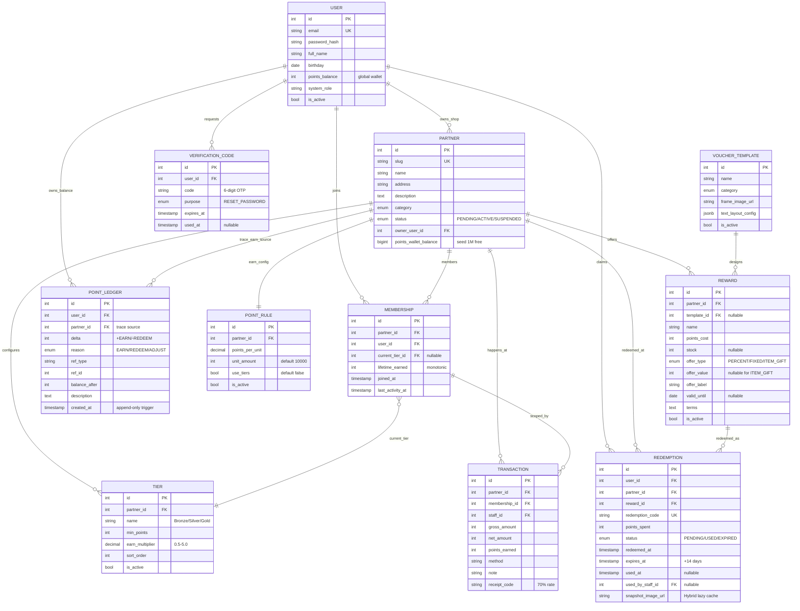

# Spec MVP "Cân bằng" — 2026-04-25

**Status**: FINAL — baseline cho plan reshape.
**Author**: Nguyễn Hải Đăng
**Decision date**: 2026-04-25
**Target**: Đồ án thực tập (8 tuần), ship-able demo cho hội đồng.

## Bối cảnh

Spec cũ `docs/danh-sach-tinh-nang.md` (13 module) over-scope cho đồ án 8 tuần. Phiên bản này là **MVP "Cân bằng"** — vừa đủ điểm tốt vừa giảm tải tài chính/thời gian. Các tính năng bị cắt được preserve cho luận văn tốt nghiệp (xem §9).

Quyết định kiến trúc cốt lõi:
- **Voucher Template** chọn phương án **C Hybrid + (i)**: FE compose React component runtime hiển thị voucher trong Ví; backend lazy-render PNG khi user xin tải/share. Admin upload PNG/JPG khung nền + JSONB `text_layout_config` để cấu hình vị trí text overlay.
- **HYBRID Points** giản lược: 1 ví điểm global cross-shop trên `users.points_balance`; mỗi Shop có ví seed 1tr điểm miễn phí trên `partners.points_wallet_balance` (KHÔNG bảng riêng).
- **Tier giữ per-partner**: mỗi Shop tự CRUD hạng (Bronze/Silver/Gold) với `min_points` (lifetime_earned threshold) + `earn_multiplier`. Shop bật `point_rule.use_tiers=true` để áp multiplier khi POS earn. Tier auto-upgrade khi `lifetime_earned >= min_points`.
- **Bỏ campaign voucher, bỏ staff, bỏ prepaid + đối soát, bỏ PWA** — preserve cho luận văn.

---

## §1. Scope

### End-user (5 modules)

| # | Module | Tính năng |
|---|---|---|
| 1 | Tài khoản | Đăng ký, Đăng nhập, **Quên mật khẩu (OTP qua email)**, Đăng xuất |
| 2 | Hồ sơ | Xem thông tin cá nhân, **Cập nhật (Tên + Ngày sinh)** |
| 3 | Thành viên | Ví điểm hệ thống (1 ví global), QR định danh, Lịch sử tích/đổi, **Hạng tại từng Shop** |
| 4 | Cửa hàng | Danh sách Shop đối tác, **Tìm kiếm theo tên**, Xem chi tiết |
| 5 | Phần thưởng | Danh sách quà toàn hệ thống, Đổi quà, **Ví Voucher** (mã QR quà đã đổi) |

### Merchant (6 modules)

| # | Module | Tính năng |
|---|---|---|
| 1 | Tài khoản | Đăng nhập, Đăng xuất, **Cập nhật Shop (Tên, Địa chỉ, Mô tả)** |
| 2 | Cấu hình | Tỷ lệ tích điểm (vd 10k VNĐ = 1 điểm) |
| 3 | **Cấu hình Tier** *(MỚI vs spec ngày 2026-04-25 cũ)* | CRUD hạng (Bronze/Silver/Gold...) — `name, min_points (lifetime_earned threshold), earn_multiplier` |
| 4 | Quà tặng | Thêm/Sửa/Xóa quà — **chọn Template + nhập ưu đãi + thời hạn** |
| 5 | POS | Quét QR khách → cộng điểm; Quét QR Voucher → xác nhận dùng quà |
| 6 | Lịch sử | Danh sách giao dịch (cộng điểm + đổi quà tại quán) |

### Admin (4 modules)

| # | Module | Tính năng |
|---|---|---|
| 1 | Quản lý Shop | Danh sách, **Phê duyệt** Shop mới, **Khóa** Shop |
| 2 | Quản lý User | Danh sách + trạng thái (read-only) |
| 3 | Thống kê | Dashboard: **tổng điểm phát hành** + **tổng quà đã đổi** |
| 4 | **Kho Template** *(MỚI)* | Upload/Sửa/Xóa template Voucher cho từng ngành |

**Tổng**: 5 + 6 + 4 = **15 modules**.

---

## §2. User stories

### End-user
- **US-EU-01**: Là khách, tôi đăng ký bằng email + password để có ví điểm cá nhân.
- **US-EU-02**: Là khách quên mật khẩu, tôi nhập email → nhận OTP 6 số → đặt mật khẩu mới.
- **US-EU-03**: Là khách, tôi cập nhật Tên hiển thị và Ngày sinh trong hồ sơ.
- **US-EU-04**: Là khách, tôi xem ví điểm tổng (1 con số global) + lịch sử tích/đổi cross-shop.
- **US-EU-05**: Là khách, tôi mở mã QR cá nhân để Merchant scan cộng điểm.
- **US-EU-06**: Là khách, tôi tìm Shop theo tên + xem chi tiết Shop.
- **US-EU-07**: Là khách, tôi duyệt danh sách quà toàn hệ thống → đổi quà → có mã QR Voucher trong Ví.
- **US-EU-08**: Là khách, tôi mở Ví Voucher để xem voucher (FE compose) hoặc tải PNG share/scan offline.
- **US-EU-09**: Là khách, tôi mở chi tiết Shop tôi từng giao dịch → xem hạng hiện tại + `lifetime_earned` đã đạt + ngưỡng hạng tiếp theo.

### Merchant
- **US-MC-01**: Là chủ Shop, tôi đăng nhập → cập nhật Tên/Địa chỉ/Mô tả Shop.
- **US-MC-02**: Là chủ Shop, tôi cài tỷ lệ tích điểm (vd 10k = 1 điểm).
- **US-MC-03**: Là chủ Shop, tôi tạo / sửa / xoá hạng (vd Bronze 0đ ×1.0, Silver 5000đ ×1.2, Gold 20000đ ×1.5) — bật `use_tiers` trong PointRule để áp multiplier khi POS earn.
- **US-MC-04**: Là chủ Shop, tôi tạo quà bằng cách: chọn Template Admin cung cấp → nhập offer + valid_until → publish.
- **US-MC-05**: Là chủ Shop, tôi quét QR khách + nhập số tiền → hệ thống tự cộng điểm cho khách (block nếu ví Shop hết). Service tự cập `lifetime_earned` + auto-upgrade tier.
- **US-MC-06**: Là chủ Shop, tôi quét QR Voucher khách xuất → xác nhận dùng + đánh dấu USED.
- **US-MC-07**: Là chủ Shop, tôi xem lịch sử giao dịch tại quán (đối soát thủ công).

### Admin
- **US-AD-01**: Là Admin, tôi duyệt Shop mới (PENDING → ACTIVE) hoặc khóa Shop (ACTIVE → SUSPENDED).
- **US-AD-02**: Là Admin, tôi xem danh sách user toàn hệ thống.
- **US-AD-03**: Là Admin, tôi xem dashboard 2 metric chính: Tổng điểm phát hành + Tổng quà đã đổi.
- **US-AD-04**: Là Admin, tôi upload template Voucher (PNG/JPG + cấu hình text overlay) phân theo category.

---

## §3. Data model delta

### Bảng hoàn toàn mới: `voucher_template`

```
id                  int PK
name                str(120) NOT NULL
category            Enum(CAFE/FOOD/RETAIL/BEAUTY/SEASONAL/OTHER) NOT NULL
frame_image_url     str(500) NOT NULL                     -- /static/voucher-templates/<uuid>.<ext>
text_layout_config  JSONB NOT NULL                        -- shape: §5
is_active           bool DEFAULT TRUE
created_at          timestamptz
updated_at          timestamptz
```

Index: `ix_voucher_template_category_active (category, is_active)`.

### Cột THÊM mới

| Bảng | Cột | Type | Note |
|---|---|---|---|
| `users` | `points_balance` | `Integer NOT NULL DEFAULT 0` | Ví điểm global cross-shop |
| `partners` | `points_wallet_balance` | `BigInteger NOT NULL DEFAULT 1_000_000` | Seed 1tr free khi tạo Shop |
| `point_ledger` | `user_id` | `FK users.id ON DELETE RESTRICT NOT NULL` | Required (drop membership_id) |
| `redemptions` | `user_id` | `FK users.id ON DELETE RESTRICT NOT NULL` | Required (drop membership_id) — cross-shop redeem không cần membership |
| `redemptions` | `snapshot_image_url` | `String(500) NULL` | PNG render cache cho Hybrid lazy render |
| `rewards` | `template_id` | `FK voucher_template.id ON DELETE SET NULL NULL` | Optional — không bắt buộc dùng template |
| `rewards` | `offer_type` | `Enum(PERCENT_DISCOUNT, FIXED_DISCOUNT, ITEM_GIFT) NOT NULL` | Loại ưu đãi |
| `rewards` | `offer_value` | `Integer NULL` | % hoặc VND, NULL với ITEM_GIFT |
| `rewards` | `offer_label` | `String(120) NOT NULL` | Text hiển thị trên voucher (vd "Tặng 1 ly Cafe Sữa") |
| `rewards` | `valid_until` | `Date NULL` | Thời hạn riêng của reward (optional, ngoài expires_at của redemption) |
| `rewards` | `terms` | `Text NULL` | Điều khoản sử dụng |

**CheckConstraint cho `rewards`** — validate `offer_value` theo `offer_type`:

```sql
(offer_type = 'PERCENT_DISCOUNT' AND offer_value BETWEEN 1 AND 100) OR
(offer_type = 'FIXED_DISCOUNT'   AND offer_value > 0) OR
(offer_type = 'ITEM_GIFT'        AND offer_value IS NULL)
```

Naming: theo memory `constraint_naming_convention_debt.md` — convention auto thêm prefix `ck_<table>_`, model chỉ truyền suffix → `name="offer_value_matches_type"` (DB sẽ thành `ck_rewards_offer_value_matches_type`).

### Cột XOÁ

| Bảng | Cột | Lý do |
|---|---|---|
| `memberships` | `points_balance` | Thay bằng `users.points_balance` (global) |
| `point_ledger` | `membership_id` | Thay bằng `user_id` (cross-shop semantic) |
| `redemptions` | `membership_id` | Thay bằng `user_id` (cross-shop redeem) |
| `transactions` | `voucher_id` | Bỏ campaign voucher |
| `transactions` | `voucher_discount_amount` | Bỏ campaign voucher |
| `transactions` | `legal_discount_ratio` | GENERATED column phụ thuộc 2 cột trên |

### Cột RENAME

| Bảng | Cột cũ | Cột mới | Lý do |
|---|---|---|---|
| `memberships` | `total_points_earned` | `lifetime_earned` | Semantic chuẩn cho tier metric (cumulative earn at-shop, monotonic) |

### Bảng XOÁ hẳn

(Verify DB list trước khi viết — `campaign_service_fees` + `campaign_fee_schedules` đã drop ở migration `e1f2a3b4c5d6`. `campaign_enrollments` chưa từng tồn tại trong baseline hiện tại — không liệt kê.)

| Bảng | Lý do |
|---|---|
| `campaigns` | Bỏ campaign khuyến mãi NĐ 81 |
| `vouchers` | Voucher campaign cũ — KHÔNG tái dùng cho voucher quà mới |
| `campaign_templates` | Template NĐ 81 — concept khác hoàn toàn `voucher_template` |
| `campaign_issuances` | Voucher issuance log (NĐ 81) |
| `campaign_regulatory_submissions` | Hồ sơ pháp lý NĐ 81 |
| `campaign_approval_events` | Audit chain NĐ 81 |
| `partner_authorizations` | Managed service ngoài scope |
| `partner_staff` | 1 account = 1 shop |
| `partner_settings_audit` | Audit log settings — không cần MVP |
| `notifications` | Phục vụ campaign/voucher — không cần MVP |

### Bảng GIỮ (có thay đổi nhỏ)

- `users` (thêm 1 cột)
- `partners` (thêm 1 cột)
- `memberships` — fields `{id, partner_id, user_id, current_tier_id, lifetime_earned, joined_at, last_activity_at}`. Drop `points_balance` (moved global), drop `archived_at`. Rename `total_points_earned → lifetime_earned`. Giữ `current_tier_id` cho tier per-partner. Membership chỉ tạo khi user EARN tại shop (POS), không tạo khi redeem cross-shop.
- `tiers` — **GIỮ**, fields `{id, partner_id, name, min_points, earn_multiplier, sort_order, is_active, deleted_at, created_at, updated_at}`. Mỗi `(partner_id, name)` unique; mỗi `(partner_id, sort_order)` unique. Tier auto-upgrade khi `lifetime_earned >= min_points`. Earn multiplier 0.50-5.00. **Refactor model**: drop `perks JSON` (MVP không dùng), thêm `sort_order Integer NOT NULL` + 2 UniqueConstraint mới (xem §6).
- `point_ledger` — append-only trigger giữ nguyên, đổi `membership_id → user_id`. Cột `partner_id` giữ để trace earn source.
- `point_rules` — đổi default `unit_amount = 10_000`, **GIỮ `use_tiers`** (default false; Shop bật khi muốn áp earn_multiplier theo tier). Partial unique 1 active rule/shop giữ.
- `transactions` — đơn giản hoá còn `{id, partner_id, membership_id, staff_id, gross_amount, net_amount, points_earned, method, note, receipt_code}`. Membership_id giữ vì transaction luôn at-shop. Drop CheckConstraint liên quan voucher.
- `rewards` — thêm cột (xem trên)
- `redemptions` — đổi schema (membership_id → user_id NOT NULL, snapshot_image_url)
- `verification_codes` — purpose `RESET_PASSWORD` đã có sẵn, reuse cho forgot password

### ER diagram (schema post-MVP active)



### Schema invariants (test §)

- **Append-only ledger**: `point_ledger` có Postgres trigger `prevent_point_ledger_mutation` block UPDATE/DELETE.
- **Partial unique 1 active rule/shop**: `CREATE UNIQUE INDEX ... ON point_rules (partner_id) WHERE is_active=true`.
- **Membership uniqueness**: `UNIQUE (partner_id, user_id)`.
- **Tier uniqueness per shop**: `UNIQUE (partner_id, name)` + `UNIQUE (partner_id, sort_order)`.
- **Reward offer_value match offer_type**: CheckConstraint `offer_value_matches_type`.
- **Lifetime monotonic**: `lifetime_earned` chỉ tăng (POS earn cộng vào), KHÔNG giảm khi redeem cross-shop hay intra-shop.
- **Ledger sum invariant**: `SUM(point_ledger.delta WHERE user_id=u) == users.points_balance` cho mọi user.
- **Wallet seed invariant**: `partners.points_wallet_balance + SUM(point_ledger.delta WHERE partner_id=p AND reason=EARN) == 1_000_000`.

### Default `point_rule` khi Admin approve Shop

Khi Admin approve Shop (PENDING → ACTIVE), backend tự động tạo `point_rule`:
- `points_per_unit = Decimal("1")` (model lưu `Numeric(10,2)`, FE input nhập int → Pydantic coerce)
- `unit_amount = 10_000` (Integer VND)
- `is_active = true`

→ Shop có thể earn ngay sau approve, không cần Merchant cài thêm.

---

## §4. API contracts

### Auth (public)

| METHOD | PATH | BODY | RESPONSE | NOTES |
|---|---|---|---|---|
| POST | `/auth/register` | `{email, password, full_name}` | `{access_token, refresh_token, user}` | Existing |
| POST | `/auth/login` | `{email, password}` | `{access_token, refresh_token}` | Existing |
| POST | `/auth/refresh` | `{refresh_token}` | `{access_token}` | Existing |
| POST | `/auth/forgot-password` | `{email}` | `{message: "OTP đã gửi (kiểm tra email)"}` | **MỚI** — gen OTP RESET_PASSWORD, log console (dev), rate limit 3/hour/email + 10/min/IP |
| POST | `/auth/reset-password` | `{email, code, new_password}` | `{message: "Đã đổi mật khẩu"}` | **MỚI** — verify OTP còn hạn + chưa dùng → set password_hash + mark code USED |

### User self-service (auth required, KHÔNG cần X-Partner-Id)

| METHOD | PATH | BODY/QUERY | RESPONSE | NOTES |
|---|---|---|---|---|
| GET | `/users/me` | — | `{id, email, full_name, birthday, points_balance}` | Add `points_balance` |
| PATCH | `/users/me` | `{full_name?, birthday?}` | `User` | Chỉ 2 field — schema strict whitelist |
| GET | `/users/me/qr` | — | `{qr_token, expires_at}` | Existing (rotate token) |
| GET | `/users/me/ledger` | `?limit&offset` | `[PointLedgerEntry+partner_name]` | Cross-shop history, sort `created_at DESC` |
| GET | `/users/me/redemptions` | `?status&limit&offset` | `[Redemption+reward+partner]` | Ví Voucher |
| GET | `/users/me/redemptions/{id}/image` | — | `image/png` (binary) | **Hybrid lazy render** — first call gen + cache (xem §5) |
| GET | `/users/me/rewards` | `?partner_id&q&limit&offset` | `[Reward+partner+template]` | Cross-shop list, default sort newest, eager-load template để FE compose |
| POST | `/users/me/redemptions` | `{reward_id}` | `{redemption_code, expires_at, ...}` | KHÔNG gen image (lazy). Lock user.points_balance + decrement reward.stock + ledger |
| GET | `/users/me/partners` | `?q&limit&offset` | `[Partner]` | Search by name (ILIKE) |
| GET | `/users/me/partners/{slug}` | — | `Partner+membership?` | Detail. Nếu user có membership tại shop → kèm `{current_tier, lifetime_earned, next_tier?, next_tier_threshold?}`. Nếu không → `membership=null`. |

### Merchant (auth + `X-Partner-Id`, `require_owner_in_partner`)

| METHOD | PATH | BODY/QUERY | RESPONSE | NOTES |
|---|---|---|---|---|
| GET | `/partner/me` | — | `Partner` | Existing |
| PATCH | `/partner/me` | `{name?, address?, description?}` | `Partner` | 3 field — schema strict |
| GET | `/partner/point-rule` | — | `PointRule` | Existing |
| PUT | `/partner/point-rule` | `{points_per_unit, unit_amount, use_tiers?}` | `PointRule` | `use_tiers` default false; bật để áp earn_multiplier khi POS earn |
| GET | `/partner/tiers` | — | `[Tier]` | List hạng của Shop, sort `min_points ASC` |
| POST | `/partner/tiers` | `{name, min_points, earn_multiplier, sort_order?}` | `Tier` | CRUD tier per-partner |
| PATCH | `/partner/tiers/{id}` | partial | `Tier` | Sửa name/min_points/earn_multiplier/sort_order/is_active |
| DELETE | `/partner/tiers/{id}` | — | `204` | Soft delete (`is_active=false`) — bảo toàn FK `membership.current_tier_id`. Block hard delete nếu còn membership refer. |
| GET | `/partner/rewards` | — | `[Reward+template]` | Existing list |
| POST | `/partner/rewards` | `{name, description, image_url?, points_cost, stock?, template_id?, offer_type, offer_value?, offer_label, valid_until?, terms?}` | `Reward` | Mở rộng |
| PATCH | `/partner/rewards/{id}` | partial | `Reward` | |
| DELETE | `/partner/rewards/{id}` | — | `204` | Soft delete (set deleted_at) |
| POST | `/partner/transactions` | `{user_qr_token, gross_amount, note?, receipt_code?}` | `Transaction+points_earned` | POS earn — xem §4.1 |
| POST | `/partner/redemptions/{code}/use` | — | `Redemption` | POS redeem confirm — set USED |
| GET | `/partner/transactions` | `?from&to&limit&offset` | `[Transaction]` | Lịch sử |
| GET | `/partner/redemptions` | `?status&from&to&limit&offset` | `[Redemption]` | Lịch sử quà đã đổi at shop (filter `redemption.partner_id = current`) |

### §4.1 POS earn flow chi tiết

`POST /partner/transactions`:
1. Resolve `user_id` từ `user_qr_token`. Token là **JWT QR (TTL 120s)** ký bằng `QR_SECRET` (không phải JWT auth secret), payload `{sub: user_id, type: "qr", exp}`. Nếu JWT expired/invalid → fallback **HMAC code 8 ký tự** (window bucket 5 phút). Lưu ý: fallback HMAC phải lookup trong `Membership` để biết user nào → **chỉ work khi user đã có membership tại shop hiện tại**. First-earn (user chưa từng giao dịch shop) → bắt buộc dùng JWT path.
2. Resolve `point_rule` active của partner. Nếu không có (Shop chưa cài) → vẫn tạo `Transaction` với `points_earned = 0`, KHÔNG ghi ledger, KHÔNG đụng ví. Trả về 200 với cảnh báo trong response.
3. Tính `base_points = floor(gross_amount / unit_amount) * points_per_unit`. Multiplier áp ở step 4 (sau khi đã lock membership).
4. **Atomic transaction (SQLAlchemy session.begin())**.

   **Lock order chuẩn toàn app** (tránh deadlock cross-shop concurrent earn cùng user): `users` → `partners` → `memberships`. Mọi flow touch wallet/balance phải acquire lock theo đúng thứ tự này.

   ```python
   async with session.begin():
       # 4a. Lock global wallet TRƯỚC
       user = await session.execute(
           select(User).where(User.id == user_id).with_for_update()
       ).scalar_one()

       # 4b. Lock partner wallet
       partner = await session.execute(
           select(Partner).where(Partner.id == partner_id).with_for_update()
       ).scalar_one()

       # 4c. Ensure membership (atomic UPSERT, tránh race 2 first-earn concurrent)
       stmt = (
           insert(Membership)
           .values(partner_id=partner_id, user_id=user_id, lifetime_earned=0)
           .on_conflict_do_nothing(index_elements=["partner_id", "user_id"])
           .returning(Membership.id)
       )
       row = await session.execute(stmt).first()
       if row is None:
           # Đã tồn tại → SELECT lại có lock
           membership = await session.execute(
               select(Membership)
               .where(Membership.partner_id == partner_id, Membership.user_id == user_id)
               .with_for_update()
           ).scalar_one()
       else:
           membership = await session.get(Membership, row[0], with_for_update=True)

       # 4d. Tính điểm với tier multiplier (dựa current_tier_id ĐANG có)
       base_points = floor(gross_amount / point_rule.unit_amount) * point_rule.points_per_unit
       if point_rule.use_tiers and membership.current_tier_id:
           tier = await session.get(Tier, membership.current_tier_id)
           points_earned = floor(base_points * tier.earn_multiplier)
       else:
           points_earned = base_points

       # 4e. Wallet check
       if partner.points_wallet_balance < points_earned:
           raise HTTPException(422, "Ví điểm Shop đã hết, không thể tích điểm cho khách. Vui lòng liên hệ Admin.")

       # 4f. Mutation
       partner.points_wallet_balance -= points_earned
       user.points_balance += points_earned
       membership.lifetime_earned += points_earned   # monotonic — chỉ tăng
       membership.last_activity_at = func.now()

       # 4g. Tier auto-upgrade — filter active + chưa xoá
       new_tier_id = await session.execute(
           select(Tier.id)
           .where(
               Tier.partner_id == partner_id,
               Tier.is_active == True,
               Tier.deleted_at.is_(None),
               Tier.min_points <= membership.lifetime_earned,
           )
           .order_by(Tier.min_points.desc())
           .limit(1)
       ).scalar_one_or_none()
       if new_tier_id and new_tier_id != membership.current_tier_id:
           membership.current_tier_id = new_tier_id

       # 4h. Insert records
       transaction = Transaction(...)
       session.add(transaction)
       await session.flush()  # cần transaction.id cho ledger
       session.add(PointLedger(
           user_id=user_id, partner_id=partner_id,
           delta=+points_earned, reason="EARN",
           ref_type="TRANSACTION", ref_id=transaction.id,
           balance_after=user.points_balance,
           description=f"Tích điểm hoá đơn #{transaction.id}",
       ))
   # commit auto khi ra khỏi block
   ```

5. Return `{transaction, points_earned, new_user_balance, new_wallet_balance, new_tier_id?}`.

### §4.2 Redeem cross-shop flow chi tiết

`POST /users/me/redemptions {reward_id}`:
1. Resolve `reward` + `partner` từ `reward_id`. Reward phải `is_active=true` và `stock > 0` (nếu có stock).
2. **Atomic transaction**:
   - `SELECT FOR UPDATE` `users.points_balance`.
   - Check `users.points_balance >= reward.points_cost`. Nếu thiếu → **422** `"Ví điểm không đủ"`.
   - Trừ `users.points_balance -= reward.points_cost`.
   - Decrement `reward.stock` nếu có (atomic UPDATE WHERE stock > 0).
   - Generate `redemption_code` unique (8 chars alphanum, retry on collision).
   - Insert `Redemption {user_id, partner_id=reward.partner_id, reward_id, redemption_code, points_spent=reward.points_cost, status=PENDING, redeemed_at=now(), expires_at=now+14d, snapshot_image_url=NULL}`. Note: `redeemed_at` NOT NULL trên model hiện tại — service phải set explicit, không có DB default.
   - Insert `PointLedger {user_id, partner_id=reward.partner_id, delta=-reward.points_cost, reason=REDEEM, ref_type=REDEMPTION, ref_id=redemption.id, balance_after=user.points_balance, description="Đổi quà ..."}`.
   - **KHÔNG tạo membership cross-shop**, **KHÔNG đụng wallet shop B**.
3. Return `{redemption, new_user_balance}`. KHÔNG render PNG (lazy).

### Admin (auth + `require_super_admin`)

| METHOD | PATH | BODY/QUERY | RESPONSE | NOTES |
|---|---|---|---|---|
| GET | `/admin/partners` | `?status&q&limit&offset` | `[Partner+stats]` | List all |
| POST | `/admin/partners/{id}/approve` | — | `Partner` | PENDING → ACTIVE + tạo default `point_rule` (xem §3) |
| POST | `/admin/partners/{id}/suspend` | `{reason?}` | `Partner` | ACTIVE → SUSPENDED |
| GET | `/admin/users` | `?q&limit&offset` | `[User+memberships_count+points_balance]` | Read-only |
| GET | `/admin/dashboard/summary` | — | `{total_points_issued, total_redemptions, partners_active, users_total}` | 2 metric chính + 2 metric phụ |
| GET | `/admin/voucher-templates` | `?category&is_active` | `[VoucherTemplate]` | |
| POST | `/admin/voucher-templates` | multipart: `name, category, text_layout_config (JSON string), file (PNG/JPG ≤ 2MB)` | `VoucherTemplate` | Upload (xem §5) |
| PATCH | `/admin/voucher-templates/{id}` | multipart partial (kể cả file mới) | `VoucherTemplate` | Khi replace file: lưu file mới với uuid mới TRƯỚC, cập nhật `frame_image_url`, sau đó xoá file cũ ở filesystem (best-effort, log warning nếu fail). KHÔNG xoá đồng thời để tránh window race nếu commit fail. |
| DELETE | `/admin/voucher-templates/{id}` | — | `204` | Soft (set `is_active=false`) — bảo toàn FK `reward.template_id` |

### Admin dashboard tính metric

- `total_points_issued = SUM(point_ledger.delta WHERE reason=EARN)` — tổng điểm Shop đã phát hành cho user.
- `total_redemptions = COUNT(redemptions WHERE status IN (PENDING, USED))` — tổng quà đã đổi.
- `partners_active = COUNT(partners WHERE status=ACTIVE)`.
- `users_total = COUNT(users WHERE is_active=true)`.

Cache 60s (Redis hoặc in-memory) để tránh full-table scan mỗi request.

### Public

| METHOD | PATH | RESPONSE | NOTES |
|---|---|---|---|
| GET | `/health` | `{status: "ok"}` | Existing |

---

## §5. Voucher Template subsystem (Hybrid C + i)

### Architecture

- **(C) Hybrid render**:
  - **FE compose runtime** (chính): trong Ví Voucher, FE render React component overlay text lên `frame_image_url` (CSS `position: absolute` theo `text_layout_config.slots`). Nhanh, không cần backend hit.
  - **Backend lazy render PNG**: chỉ khi user bấm "Tải PNG" / "Share" → backend Pillow render + cache. Endpoint `GET /users/me/redemptions/{id}/image`.
- **(i) Admin upload + JSONB layout**: Admin upload PNG/JPG khung nền, JSONB cấu hình vị trí từng text overlay slot.

### `text_layout_config` JSONB shape (concrete)

```json
{
  "slots": [
    {"key": "partner_name",    "x": 50,  "y": 60,  "font": "Roboto",      "size": 16, "color": "#FFFFFF", "align": "left"},
    {"key": "offer_label",     "x": 50,  "y": 120, "font": "Roboto",      "size": 28, "color": "#FFFFFF", "align": "left"},
    {"key": "offer_value",     "x": 50,  "y": 160, "font": "Roboto-Bold", "size": 48, "color": "#FFD700", "align": "left"},
    {"key": "valid_until",     "x": 50,  "y": 220, "font": "Roboto",      "size": 14, "color": "#CCCCCC", "align": "left"},
    {"key": "redemption_code", "x": 200, "y": 280, "font": "Roboto-Mono", "size": 18, "color": "#000000", "align": "center"}
  ]
}
```

**Slot keys hỗ trợ** (whitelist, validate trong Pydantic schema):
- `partner_name` → `partner.name`
- `offer_label` → `reward.offer_label`
- `offer_value` → format theo `offer_type`:
  - `PERCENT_DISCOUNT` → `"-{value}%"` (vd `"-20%"`)
  - `FIXED_DISCOUNT` → `"-{value}đ"` format VN (vd `"-50.000đ"`)
  - `ITEM_GIFT` → `""` (label đã chứa thông tin)
- `valid_until` → `format(reward.valid_until, "dd/MM/yyyy")` hoặc `format(redemption.expires_at)` nếu reward.valid_until NULL
- `redemption_code` → `redemption.redemption_code`

**Size & color validation**:
- `size`: 8 ≤ size ≤ 96
- `color`: regex `^#[0-9A-Fa-f]{6}$`
- `align`: enum `left|center|right`
- `x, y`: 0 ≤ ≤ 2000 (px)
- Fonts: hard-code list `["Roboto", "Roboto-Bold", "Roboto-Mono"]` (đặt sẵn `backend/static/fonts/*.ttf`).

### Flow Admin tạo template

1. Admin mở `/admin/templates/new`.
2. Nhập `name`, chọn `category`.
3. Upload ảnh khung (PNG/JPG, cap 2MB) — preview ngay FE.
4. Cấu hình `text_layout_config` qua UI form list slots (có thể overlay preview lên ảnh để chọn vị trí trực quan — nice-to-have, MVP có thể nhập số).
5. Submit multipart → backend:
   - Validate file: `content_type IN (image/png, image/jpeg)` + magic bytes check (Pillow `Image.open` + `verify()`).
   - Cap size 2MB (FastAPI dependency `Depends(check_upload_size)`).
   - Save: `backend/static/voucher-templates/{uuid}.{ext}`.
   - Validate `text_layout_config` JSON theo Pydantic schema (whitelist keys, range numeric).
   - Insert `voucher_template` row, `frame_image_url = /static/voucher-templates/{uuid}.{ext}`.
6. Return `VoucherTemplate`.

### Flow Merchant tạo Reward

1. Merchant mở `/partner/rewards/new`.
2. Chọn template từ dropdown (filter `category` theo Shop's `category` + `is_active=true`).
3. Nhập:
   - `name` (tên reward nội bộ)
   - `offer_type` + `offer_value` (nếu PERCENT/FIXED)
   - `offer_label` (text hiển thị trên voucher — vd "Giảm 20% toàn menu")
   - `valid_until` (optional)
   - `terms` (optional)
   - `points_cost` + `stock` (optional)
4. Preview FE compose voucher trực quan (FE đã có template metadata).
5. Submit → backend lưu Reward, link `template_id`.

### Flow User redeem + xem voucher (Hybrid LAZY)

1. User bấm "Đổi quà" → `POST /users/me/redemptions {reward_id}` (xem §4.2).
2. User mở Ví Voucher → `GET /users/me/redemptions` → list redemptions.
3. Bấm 1 voucher → mở detail page:
   - FE đã có `template.frame_image_url` + `template.text_layout_config` + reward data + redemption data.
   - **FE compose**: render `` + `<div style={{position:'absolute', top:slot.y, left:slot.x, ...}}>{value}</div>` cho từng slot.
   - QR code render bằng `qrcode.react` dùng `redemption_code`.
4. User bấm "Lưu ảnh" / "Share" → `GET /users/me/redemptions/{id}/image`:
   - Check `redemption.snapshot_image_url`:
     - Nếu NULL: load `Image.open(template.frame_image_url)` + `ImageDraw.Draw` + `draw.text((slot.x, slot.y), value, font=ImageFont.truetype(...))` cho từng slot, save `backend/static/redemption-snapshots/{redemption.id}.png`, UPDATE `snapshot_image_url`.
     - Nếu đã có: skip render.
   - Return `image/png` (FileResponse hoặc redirect 302 đến `/static/redemption-snapshots/...`).
   - **Concurrency note**: 2 GET song song trên cùng `redemption.id` sẽ cùng thấy `snapshot_image_url=NULL` → cả 2 cùng render Pillow + cùng save vào path deterministic `{redemption.id}.png` + cùng UPDATE. Output deterministic (cùng template + cùng data) → last-write-wins OK, không cần advisory lock. Chấp nhận overhead nhỏ trong edge case rất hiếm này.
5. Merchant scan QR voucher (chứa `redemption_code`) → `POST /partner/redemptions/{code}/use`:
   - Resolve redemption từ code.
   - Check `redemption.partner_id == current_partner_id` (chỉ partner sở hữu reward mới mark USED).
   - Check `status == PENDING` và `expires_at > now`.
   - Set `status=USED, used_at=now, used_by_staff_id=current_user.id`.

### Storage layout

- **Frame templates**: `backend/static/voucher-templates/{uuid}.{ext}` (PNG/JPG)
- **Rendered snapshots**: `backend/static/redemption-snapshots/{redemption.id}.png`
- **Fonts**: `backend/static/fonts/{Roboto,Roboto-Bold,Roboto-Mono}.ttf` (commit vào repo)
- **FastAPI mount**: `app.mount("/static", StaticFiles(directory="static"), name="static")`
- **Cap upload**: 2MB. Reject với 413 nếu vượt.
- **Type whitelist**: `image/png`, `image/jpeg`. Reject với 415 nếu không match.

### Deps thêm

- `Pillow` (PIL) — render PNG. Add vào `backend/requirements.txt`.
- `python-multipart` — đã có sẵn (FastAPI dep).

### Soft-delete template — bảo toàn voucher cũ

Khi Admin "xoá" template (`DELETE /admin/voucher-templates/{id}`):
- Set `is_active=false` (KHÔNG hard delete).
- Reward đã link `template_id` vẫn render được (FE check `is_active=true` chỉ khi list cho Merchant tạo Reward mới).
- Voucher đã render snapshot vẫn dùng được.
- Nếu Admin thực sự muốn purge → manual SQL (out-of-scope).

---

## §6. Migration plan

### Single Alembic revision

File: `backend/alembic/versions/d4e5f6a7b8c9_pivot_to_mvp_balanced.py`

`down_revision = 'e2a3b4c5d6e7'` (current head).

#### `upgrade()` — order quan trọng (FK reverse drop):

```python
def upgrade():
    # 0. Drop view phụ thuộc campaign/voucher TRƯỚC bất cứ drop_table nào
    op.execute("DROP VIEW IF EXISTS v_campaign_stats")

    # 1. Drop FK consumers trước (bảng phụ thuộc)
    op.drop_table("notifications")              # phục vụ campaign/voucher
    op.drop_table("campaign_approval_events")   # NĐ 81 audit
    op.drop_table("campaign_regulatory_submissions")  # NĐ 81 hồ sơ
    op.drop_table("campaign_issuances")         # voucher issuance log
    op.drop_table("partner_authorizations")     # managed service
    op.drop_table("partner_staff")
    op.drop_table("partner_settings_audit")     # audit log settings
    op.drop_table("vouchers")                   # campaign vouchers
    op.drop_table("campaigns")
    op.drop_table("campaign_templates")         # NĐ 81 template

    # 2. Drop cột phụ thuộc voucher trong các bảng giữ
    op.drop_column("transactions", "legal_discount_ratio")  # GENERATED — drop trước
    op.drop_column("transactions", "voucher_discount_amount")
    op.drop_column("transactions", "voucher_id")
    op.drop_column("memberships", "points_balance")
    op.drop_column("memberships", "archived_at")  # MVP không cần suspend membership

    # 3. Rename memberships.total_points_earned → lifetime_earned (semantic chuẩn cho tier metric)
    op.alter_column("memberships", "total_points_earned",
                    new_column_name="lifetime_earned", existing_type=sa.Integer(),
                    existing_nullable=False, existing_server_default="0")
    # CheckConstraint cũ ck_memberships_total_nonneg refer cột cũ → drop + tạo lại
    op.drop_constraint("ck_memberships_total_nonneg", "memberships", type_="check")
    op.create_check_constraint("lifetime_earned_nonneg", "memberships", "lifetime_earned >= 0")
    # Drop CheckConstraint cũ ck_memberships_balance_nonneg vì đã drop points_balance
    op.drop_constraint("ck_memberships_balance_nonneg", "memberships", type_="check")

    # 4. Đổi default unit_amount = 10000 (point_rules.use_tiers GIỮ — Shop bật để áp earn_multiplier)
    op.alter_column("point_rules", "unit_amount", server_default="10000")

    # 4b. Tier schema realignment — drop perks (MVP không cần), add sort_order, UNIQUE per-shop
    op.drop_column("tiers", "perks")
    op.add_column("tiers", sa.Column("sort_order", sa.Integer(), nullable=False, server_default="0"))
    op.alter_column("tiers", "sort_order", server_default=None)  # bỏ default sau khi backfill row cũ
    op.create_unique_constraint("uq_tiers_partner_name", "tiers", ["partner_id", "name"])
    op.create_unique_constraint("uq_tiers_partner_sort_order", "tiers", ["partner_id", "sort_order"])

    # 5. Tạo bảng voucher_template TRƯỚC (vì rewards.template_id FK tới)
    op.create_table("voucher_template",
        sa.Column("id", sa.Integer(), primary_key=True),
        sa.Column("name", sa.String(120), nullable=False),
        sa.Column("category", sa.String(20), nullable=False),
        sa.Column("frame_image_url", sa.String(500), nullable=False),
        sa.Column("text_layout_config", postgresql.JSONB, nullable=False),
        sa.Column("is_active", sa.Boolean(), nullable=False, server_default="true"),
        sa.Column("created_at", sa.DateTime(timezone=True), server_default=sa.func.now()),
        sa.Column("updated_at", sa.DateTime(timezone=True), server_default=sa.func.now()),
    )
    op.create_index("ix_voucher_template_category_active", "voucher_template", ["category", "is_active"])

    # 6. THÊM cột mới (server_default cho phép NOT NULL trên row cũ)
    op.add_column("users", sa.Column("points_balance", sa.Integer(), nullable=False, server_default="0"))
    op.add_column("partners", sa.Column("points_wallet_balance", sa.BigInteger(), nullable=False, server_default="1000000"))

    op.add_column("rewards", sa.Column("template_id", sa.Integer(), sa.ForeignKey("voucher_template.id", ondelete="SET NULL"), nullable=True))
    op.add_column("rewards", sa.Column("offer_type", sa.String(20), nullable=False, server_default="ITEM_GIFT"))
    op.add_column("rewards", sa.Column("offer_value", sa.Integer(), nullable=True))
    op.add_column("rewards", sa.Column("offer_label", sa.String(120), nullable=False, server_default=""))
    op.add_column("rewards", sa.Column("valid_until", sa.Date(), nullable=True))
    op.add_column("rewards", sa.Column("terms", sa.Text(), nullable=True))
    op.create_check_constraint(
        "offer_value_matches_type",
        "rewards",
        "(offer_type = 'PERCENT_DISCOUNT' AND offer_value BETWEEN 1 AND 100) "
        "OR (offer_type = 'FIXED_DISCOUNT' AND offer_value > 0) "
        "OR (offer_type = 'ITEM_GIFT' AND offer_value IS NULL)",
    )

    # 7. Migration cho point_ledger + redemptions: add user_id (NOT NULL via server_default trick là không work cho FK)
    #    → DB rỗng (wipe-and-reseed) nên có thể add cột NOT NULL trực tiếp. Nếu DB có data thật:
    #    → step 7a: add nullable, step 7b: backfill từ membership.user_id, step 7c: alter NOT NULL.
    #    Đồ án dùng wipe-and-reseed → simple path:
    op.add_column("point_ledger", sa.Column("user_id", sa.Integer(), sa.ForeignKey("users.id", ondelete="RESTRICT"), nullable=False))
    op.add_column("redemptions", sa.Column("user_id", sa.Integer(), sa.ForeignKey("users.id", ondelete="RESTRICT"), nullable=False))
    op.add_column("redemptions", sa.Column("snapshot_image_url", sa.String(500), nullable=True))

    # 8. Drop cột membership_id sau khi user_id sẵn sàng
    op.drop_column("redemptions", "membership_id")
    op.drop_column("point_ledger", "membership_id")

    # 9. (Không có bảng system_settings trong schema hiện tại — bỏ qua)
```

#### `downgrade()`: KHÔNG implement

`raise NotImplementedError("MVP balanced pivot là one-way. Wipe-and-reseed nếu cần rollback.")`

### Wipe-and-reseed strategy (CHỐT)

DB hiện tại có data demo thôi (đồ án), không có data prod thật.

```bash
docker compose -p loyalty-prod -f docker-compose.prod.yml down -v   # drop volume Postgres
docker compose -p loyalty-prod -f docker-compose.prod.yml up -d     # Alembic auto upgrade head trên DB rỗng
docker exec loyalty-backend-prod python -m app.scripts.seed_demo   # re-seed
```

**Why wipe**: `point_ledger` có DB trigger `prevent_point_ledger_mutation` block UPDATE/DELETE → backfill `user_id` từ `membership.user_id` không khả thi qua UPDATE thường. Wipe là path đơn giản nhất. Memory ref: `project_point_ledger_append_only_trigger.md`.

---

## §7. Cuts — explicit

### Backend models — KHÔNG xoá file Python (giải thích)

Baseline migration `c4d5e6f7a8b9_create_loyalty_baseline_schema.py` import toàn bộ model files (`from app.models import campaign, tier, voucher, ...`) để `Base.metadata.create_all` register schema. Wipe-and-reseed sẽ re-run từ migration đầu — nếu xoá file Python → `ImportError` chặn container start.

→ **Phương án (a) — KEEP model files orphan** (cho các bảng đã DROP):
- KHÔNG xoá file `app/models/{campaign,voucher,campaign_template,campaign_issuance,campaign_regulatory_submission,campaign_approval_event,partner_staff,partner_authorization,partner_settings_audit,notification}.py`.
- Xoá khỏi `app/models/__init__.py` exports (nếu có) để runtime code không nhỡ tay import.
- Xoá hoàn toàn services + routes + FE references (xem dưới).
- Bảng vật lý drop bởi migration §6 — model class trở thành "dead code" nhưng SQLAlchemy không complain (metadata register table không bắt buộc table tồn tại trong DB ở runtime).

**Lưu ý**: `app/models/tier.py` **KHÔNG orphan** — tier table giữ active per-partner. Refactor model nếu cần (xem §3 Bảng GIỮ).

| File model orphan | Lý do giữ |
|---|---|
| `app/models/campaign.py` | Baseline migration import |
| `app/models/voucher.py` | Baseline migration import |
| `app/models/campaign_template.py` | Migration `b1c2d3e4f5a6` create_table dùng metadata |
| `app/models/campaign_issuance.py` | Migration `f4a5b6c7d8e9` create_table |
| `app/models/campaign_regulatory_submission.py` | Migration `e9f0a1b2c3d4` create_table |
| `app/models/campaign_approval_event.py` | Migration `f0a1b2c3d4e5` create_table |
| `app/models/partner_staff.py` | Baseline migration import |
| `app/models/partner_authorization.py` | Migration `a3b4c5d6e7f8` create_table |
| `app/models/partner_settings_audit.py` | Baseline migration import |
| `app/models/notification.py` | Baseline migration import |

### Backend services xoá

| File | Lý do |
|---|---|
| `app/services/campaign_service.py` | Bỏ campaign |
| `app/services/voucher_service.py` | Bỏ voucher campaign |
| `app/services/campaign_template_service.py` | Bỏ NĐ 81 template |
| `app/services/campaign_enrollment_service.py` | Bỏ enrollment |
| `app/services/partner_staff_service.py` | Bỏ staff |
| `app/services/partner_authorization_service.py` | Bỏ authorization |

### Backend services REFACTOR LỚN

| File | Thay đổi chính |
|---|---|
| `app/services/transaction_service.py` | Bỏ apply voucher, bỏ welcome voucher. **Giữ tier multiplier** (lookup `membership.current_tier_id` khi `point_rule.use_tiers=true`). Earn flow: trừ `partners.points_wallet_balance` + cộng `users.points_balance` + cộng `membership.lifetime_earned` + auto-upgrade tier + ledger entry. Block 422 khi wallet exhausted. |
| `app/services/redemption_service.py` | Bỏ `membership_id` param. Đổi sang `user_id`. Lock `User.points_balance` thay `Membership.points_balance`. Bỏ require membership tại shop B (cross-shop). |
| `app/services/membership_service.py` | Get-or-create membership chỉ khi POS earn. Cập `lifetime_earned += points_earned` (chỉ tăng, KHÔNG giảm khi redeem). Auto-upgrade tier: `current_tier_id = max(tiers WHERE min_points <= lifetime_earned)`. |
| `app/services/tier_service.py` | **REFACTOR**: scope per-partner CRUD (require_owner_in_partner). Drop logic upgrade dựa `membership.points_balance` cũ — upgrade chuyển vào `membership_service` (trigger từ POS earn dùng `lifetime_earned`). |
| `app/services/auth_service.py` | THÊM `request_password_reset(email)` + `reset_password(email, code, new_password)`. |

### Backend services MỚI

| File | Mục đích |
|---|---|
| `app/services/voucher_template_service.py` | CRUD voucher_template + validate `text_layout_config` schema |
| `app/services/voucher_render_service.py` | Pillow render PNG cho redemption snapshot |
| `app/services/admin_dashboard_service.py` | Aggregate metric (cache 60s) |

### Backend jobs xoá

- `app/jobs/birthday_voucher_job.py`
- `app/jobs/welcome_voucher_job.py` (nếu tồn tại)
- APScheduler unregister các jobs trên trong `app/jobs/__init__.py`.

### Routers cắt khỏi `app/main.py` (từ 22 → ~13)

DROP:
- `admin_campaigns`
- `partner_staff`
- `campaigns`
- `campaign_enrollment`
- `partner_authorization`
- `vouchers`
- `notifications` *(verify khi implement — nếu chỉ phục vụ campaign/voucher thì drop)*
- `settings` (router phụ thuộc `partner_settings_audit` + `partner_staff` — đã DROP; merchant cập Shop info dùng `PATCH /partner/me`)

KEEP + tinh gọn:
- `auth, partner, partners, users, admin, point_rules, tiers, transactions, members, qr, rewards, redemptions, analytics`

ADD MỚI:
- `admin_voucher_templates` — Admin CRUD template
- `auth` mở rộng 2 endpoint: `forgot-password` + `reset-password`

### Frontend pages xoá

| Path | Lý do |
|---|---|
| `(admin)/admin/campaigns/*` | Bỏ campaign NĐ 81 |
| `(admin)/admin/templates/*` | **REWRITE** từ đầu cho voucher_template (UI hoàn toàn khác) |
| `(partner)/partner/campaigns/*` | Bỏ campaign |
| `(partner)/partner/staff/*` | Bỏ staff |
| `(member)/member/vouchers/[id]/*` (nếu là campaign voucher) | Voucher cũ là campaign voucher — không tái dùng cho redemption voucher; thay bằng `(member)/member/redemptions/[id]` |

### FE pages MỚI / REWRITE

| Path | Note |
|---|---|
| `(auth)/forgot-password/page.tsx` | **MỚI** — form email |
| `(auth)/reset-password/page.tsx` | **MỚI** — form OTP + new password |
| `(admin)/admin/templates/page.tsx` | **REWRITE** — list + upload PNG/JPG + JSONB editor |
| `(admin)/admin/templates/[id]/page.tsx` | **REWRITE** — edit |
| `(member)/member/profile/edit/page.tsx` | **MỚI** (nếu chưa có) — form Tên + Ngày sinh |
| `(member)/member/rewards/page.tsx` | **REWRITE** — cross-shop list + global balance |
| `(member)/member/redemptions/[id]/page.tsx` | **MỚI** — Hybrid render (FE compose) + nút "Tải PNG" |
| `(member)/member/partners/[slug]/page.tsx` | **REWRITE** — Detail Shop + (nếu user có membership) hiển thị hạng hiện tại + `lifetime_earned` + ngưỡng tier tiếp theo |
| `(partner)/partner/rewards/new/page.tsx` | **REWRITE** — chọn template + offer fields |
| `(partner)/partner/tiers/page.tsx` | **REWRITE** — list + CRUD tier (Bronze/Silver/Gold) per Shop với `name, min_points, earn_multiplier, sort_order` |

### FE hooks xoá (dangling)

- `lib/hooks/use-admin-campaigns.ts`
- `lib/hooks/use-campaigns.ts`
- `lib/hooks/use-vouchers.ts`
- `lib/hooks/use-partner-staff.ts`
- `lib/hooks/use-campaign-templates.ts` *(rewrite thành `use-voucher-templates.ts`)*

**FE hooks GIỮ + REFACTOR**:
- `lib/hooks/use-tiers.ts` — refactor sang Merchant CRUD endpoints `/partner/tiers` (thay vì admin endpoint cũ)

### Test impact (cảnh báo, chưa plan chi tiết)

- Unit/integration tests cho campaign/voucher/staff/authorization → xoá hoặc đặt skip với note `# CUT in MVP balanced 2026-04-25 (xem docs/spec-mvp-2026-04-25.md §7)`.
- Refactor tests cho redemption (`membership_id → user_id`), transaction (drop voucher path).
- Refactor tests cho tier_service: scope per-partner CRUD; upgrade dựa `lifetime_earned` thay `points_balance`.
- Test mới: forgot-password + reset-password flow, voucher_template upload, redemption Hybrid render endpoint, Merchant tier CRUD, tier auto-upgrade khi POS earn vượt threshold.
- **Test rewrite là task quan trọng phase 2** — spec không list từng test, plan chi tiết khi implement.

---

## §8. Demo seed plan

### Mục tiêu seed

- 1 super admin: `admin@loyalty.vn / admin1234`
- 3 voucher templates seeded:
  - CAFE: `seed-cafe.png` (asset đặt sẵn `backend/static/voucher-templates/seed-cafe.png`)
  - FOOD: `seed-food.png`
  - OTHER: `seed-other.png`
- 2 partners ACTIVE: `Cafe Cộng (cafe)`, `Lala Food (food)` — với `points_wallet_balance = 1_000_000`
- 1 partner PENDING: `Trà Sữa Demo` — để Admin demo approve flow
- 5 customers Cafe (`khach1-5@gmail.com`), 5 customers Lala (`lala1-5@gmail.com`) — `points_balance` random 0-200
- Default `point_rule` cho 2 ACTIVE partner (`points_per_unit=1, unit_amount=10000, use_tiers=true`)
- 3 tiers/partner cho 2 ACTIVE partner: Bronze (`min_points=0, earn_multiplier=1.0`), Silver (`min_points=500, earn_multiplier=1.2`), Gold (`min_points=2000, earn_multiplier=1.5`)
- Mỗi partner 3-5 rewards (link `template_id` theo category)
- Vài transactions POS rải `receipt_code` 70%
- 1-2 redemption per customer (status PENDING + 1 USED) — tạo qua `RedemptionService.redeem` để có ledger entry đúng

### File: `backend/seed_demo.py` (rewrite from scratch)

Logic order (idempotent — truncate trước khi seed):

```python
async def seed():
    # 1. Truncate (idempotent reseed)
    await session.execute(text("""
        TRUNCATE TABLE
            redemptions, point_ledger, transactions, memberships,
            rewards, voucher_template, point_rules, tiers,
            partners, users,
            verification_codes
        RESTART IDENTITY CASCADE
    """))

    # 2. Insert super admin
    admin = await create_user(email="admin@loyalty.vn", password="admin1234",
                              full_name="Super Admin", system_role="super_admin")

    # 3. Insert 3 voucher_template (asset PNG đã commit sẵn)
    tpl_cafe = await create_voucher_template(name="Khung Cafe Vintage", category="CAFE",
        frame_image_url="/static/voucher-templates/seed-cafe.png",
        text_layout_config={...})  # default 5 slots
    tpl_food = await create_voucher_template(...)
    tpl_other = await create_voucher_template(...)

    # 4. Insert 2 ACTIVE partners + 1 PENDING (wallet seed 1tr auto từ default)
    cafe = await create_partner(name="Cafe Cộng", slug="cafe-cong",
                                category="CAFE", status="ACTIVE", owner_email="owner@cafe.vn")
    lala = await create_partner(name="Lala Food", slug="lala-food",
                                category="FOOD", status="ACTIVE", owner_email="owner@lala.vn")
    pending = await create_partner(name="Trà Sữa Demo", status="PENDING",
                                   owner_email="owner@demo.vn")

    # 5. Default point_rule cho 2 ACTIVE partner (use_tiers=true để áp earn_multiplier)
    await create_point_rule(partner_id=cafe.id, points_per_unit=1, unit_amount=10000, use_tiers=True)
    await create_point_rule(partner_id=lala.id, points_per_unit=1, unit_amount=10000, use_tiers=True)

    # 5b. Default tiers per partner (Bronze/Silver/Gold)
    for partner in [cafe, lala]:
        await create_tier(partner_id=partner.id, name="Bronze", min_points=0,    earn_multiplier=1.0, sort_order=1)
        await create_tier(partner_id=partner.id, name="Silver", min_points=500,  earn_multiplier=1.2, sort_order=2)
        await create_tier(partner_id=partner.id, name="Gold",   min_points=2000, earn_multiplier=1.5, sort_order=3)

    # 6. Customers
    cafe_users = [await create_user(email=f"khach{i}@gmail.com", password="khach1234",
                                    full_name=f"Khách {i}") for i in range(1, 6)]
    lala_users = [await create_user(email=f"lala{i}@gmail.com", password="khach1234",
                                    full_name=f"Khách Lala {i}") for i in range(1, 6)]

    # 7. Rewards per partner (link template_id theo category)
    for partner, tpl in [(cafe, tpl_cafe), (lala, tpl_food)]:
        for i in range(3):
            await create_reward(partner_id=partner.id, template_id=tpl.id,
                                name=f"Reward {i+1}", points_cost=50*(i+1),
                                offer_type="PERCENT_DISCOUNT", offer_value=10*(i+1),
                                offer_label=f"Giảm {10*(i+1)}%")

    # 8. Sample transactions (POS earn) — gọi service để có ledger đúng
    for user in cafe_users[:3]:
        await transaction_service.process_earn(
            partner_id=cafe.id, user_qr_token=user.qr_token,
            staff_id=cafe.owner_user_id, gross_amount=100000,
            receipt_code=f"HD{random.randint(1000,9999)}")

    # 9. Sample redemptions
    for user in cafe_users[:2]:
        rewards = await get_rewards_partner(cafe.id)
        await redemption_service.redeem(user_id=user.id, reward_id=rewards[0].id)
```

### Asset commit

Cần thêm `backend/static/voucher-templates/seed-{cafe,food,other}.png` (3 file PNG khoảng 800x500px) vào git để demo seed chạy được. Nếu chưa có → placeholder bằng PIL gen runtime trong seed (pure-color rectangle với label).

---

## §9. Out-of-scope — reserved cho luận văn tốt nghiệp

### Cắt khỏi đồ án (lưu memory cho thesis)

| Feature | Memory ref | Lý do giữ cho thesis |
|---|---|---|
| **PWA** (offline, push notification, install prompt, share target, background sync) | `project_pwa_out_of_internship.md` | Stack phức tạp, scope thesis riêng — đồ án giữ infra Serwist hiện có nhưng KHÔNG add feature mới |
| **Prepaid Points + Admin clearing house + Settlement** (dual rate 1000đ mua / 500đ trả) | `project_prepaid_points_requirement.md` | Business model bền vững nhưng đòi payment gateway + đối soát workflow — thesis-grade |
| **Campaign voucher / Khuyến mãi NĐ 81** (managed service ops) | spec cũ `docs/danh-sach-tinh-nang.md` §3-4 | Quy định pháp lý — managed service model thesis |
| **Đổi mật khẩu khi đã login** | — | Chỉ giữ flow forgot password unauth |
| **Quản lý nhân viên / chi nhánh / phân quyền staff** | — | 1 account = 1 shop |
| **Admin: QL Điểm chi tiết / Danh mục / Logs / Khóa user** | — | Dashboard 2 metric đủ |
| **Filter category + search nâng cao** | — | Search by name only |

### Báo cáo đồ án

- Section "Định hướng phát triển luận văn tốt nghiệp" liệt kê các feature trên.
- KHÔNG claim đã làm những phần này trong báo cáo đồ án.

---

## Acceptance criteria (cho hội đồng demo)

### Auth
- [ ] User đăng ký + đăng nhập + đăng xuất
- [ ] User quên mật khẩu: nhập email → nhận OTP (console log dev) → đặt mật khẩu mới
- [ ] OTP rate limit hoạt động (3/hour/email)

### User self-service
- [ ] User update Tên + Ngày sinh
- [ ] User xem ví điểm (1 con số global) + lịch sử cross-shop
- [ ] User mở QR cá nhân (rotate token)
- [ ] User search Shop theo tên + xem chi tiết Shop
- [ ] User xem chi tiết Shop có membership → hiển thị hạng hiện tại + `lifetime_earned` + ngưỡng tier tiếp theo

### Cross-shop redeem
- [ ] User đổi quà cross-shop: tích điểm Shop A → đổi quà Shop B (chưa từng giao dịch Shop B) → có voucher trong Ví
- [ ] Wallet check: đổi quà mà ví thiếu → 422 message Vietnamese

### Voucher Hybrid
- [ ] User mở Ví Voucher + show voucher (FE compose React component overlay)
- [ ] User bấm "Tải PNG" → backend lazy render Pillow → image hiển thị + cache vào snapshot_image_url
- [ ] Lần thứ 2 tải → return cached, không re-render

### Merchant
- [ ] Merchant cập nhật Shop info (Tên + Địa chỉ + Mô tả)
- [ ] Merchant cài point_rule (10k = 1 điểm) + bật/tắt `use_tiers`
- [ ] Merchant CRUD tier (Bronze/Silver/Gold) per Shop với `name, min_points, earn_multiplier`
- [ ] Merchant tạo Reward chọn Template + offer (PERCENT/FIXED/ITEM_GIFT)
- [ ] Merchant POS scan QR khách + nhập gross_amount → cộng điểm cho khách + trừ ví Shop
- [ ] **Tier auto-upgrade**: POS earn cộng `lifetime_earned`; khi vượt ngưỡng → `current_tier_id` cập nhật trong cùng transaction
- [ ] **Tier multiplier**: với `use_tiers=true`, points cộng = `floor(base_points × tier.earn_multiplier)`
- [ ] **Wallet exhaustion**: Shop hết 1tr điểm → POS earn block 422 với message Vietnamese, KHÔNG tạo Transaction
- [ ] Merchant POS scan QR Voucher → mark USED (chỉ partner sở hữu reward mới mark được)
- [ ] Merchant xem lịch sử giao dịch + redemption tại quán

### Admin
- [ ] Admin approve Shop PENDING → ACTIVE (auto-create point_rule với default 10k=1)
- [ ] Admin suspend Shop ACTIVE → SUSPENDED
- [ ] Admin xem dashboard 2 metric (tổng điểm phát hành + tổng quà đã đổi)
- [ ] Admin upload voucher template (PNG/JPG ≤ 2MB) + cấu hình text_layout_config qua UI
- [ ] Admin edit + soft-delete template (reward link cũ vẫn render được)

### Edge cases
- [ ] Upload file > 2MB → 413
- [ ] Upload file không phải PNG/JPG → 415
- [ ] `text_layout_config` JSON invalid (sai key, color sai format) → 422
- [ ] Redeem reward `is_active=false` → 422
- [ ] Redeem reward `stock=0` → 422
- [ ] Mark USED voucher đã expired → 422
- [ ] Mark USED voucher đã USED → 422 idempotent

### Sanity checks (CI/dev)
- [ ] **Wipe-and-reseed end-to-end**: `docker compose down -v && up -d && python -m app.scripts.seed_demo` chạy clean, không ImportError, không Alembic fail.
- [ ] **Ledger invariant**: với mỗi user, `SUM(point_ledger.delta WHERE user_id=user.id) == users.points_balance` sau seed.
- [ ] **Wallet invariant**: với mỗi partner ACTIVE, `partners.points_wallet_balance + SUM(point_ledger.delta WHERE partner_id=partner.id AND reason=EARN) == 1_000_000` (seed ban đầu).
- [ ] **Membership uniqueness**: 2 sequential POS earn cùng `(partner_id, user_id)` → chỉ 1 row `memberships`, không bùng `uq_memberships_partner_user`.

---

**END**
